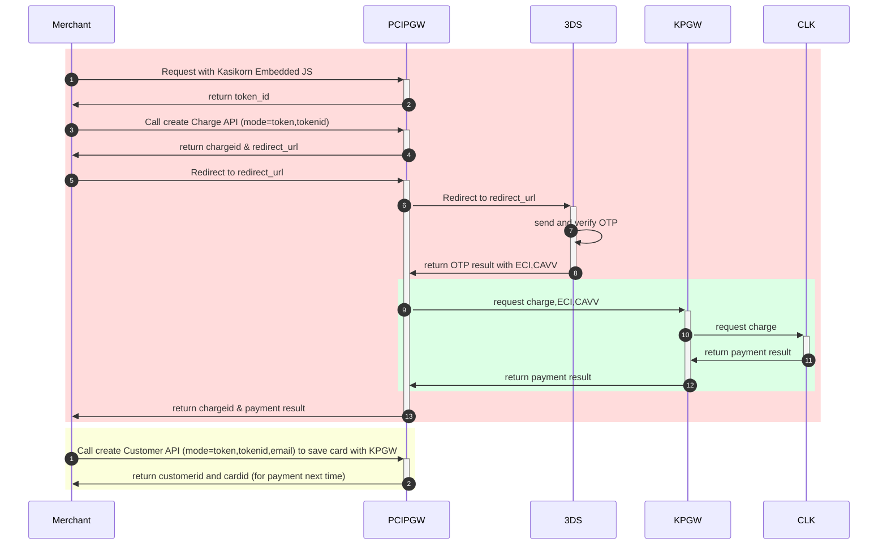
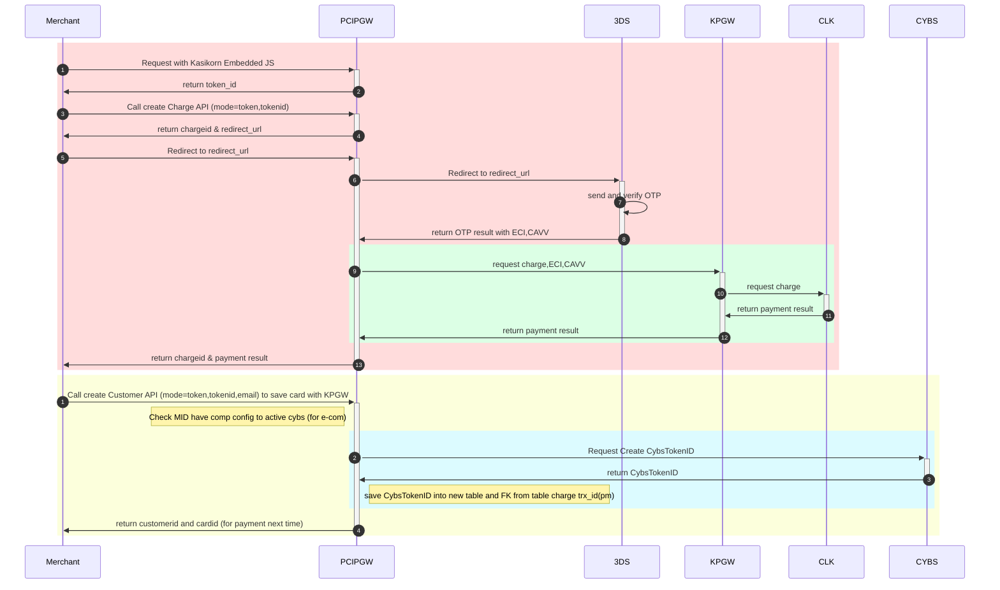
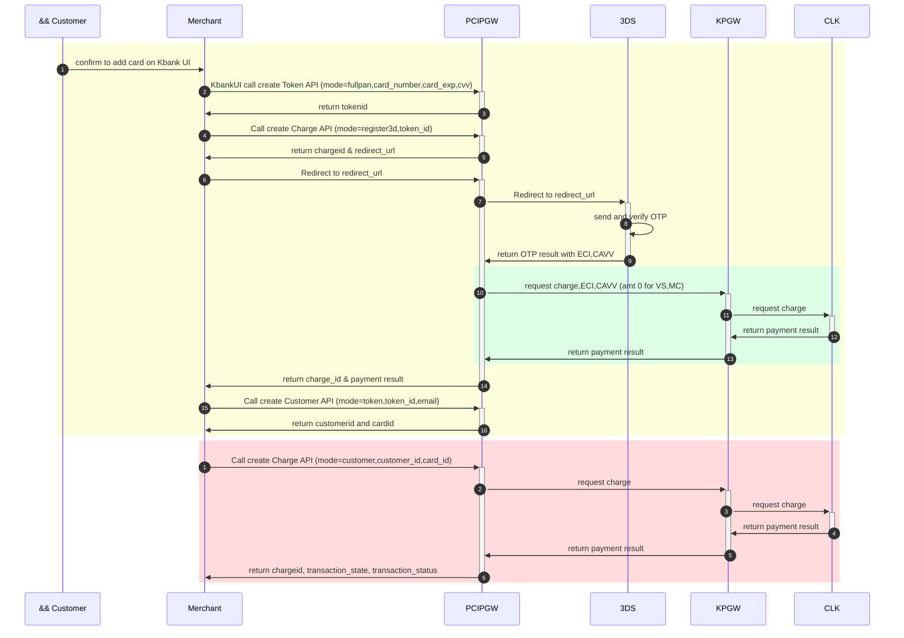
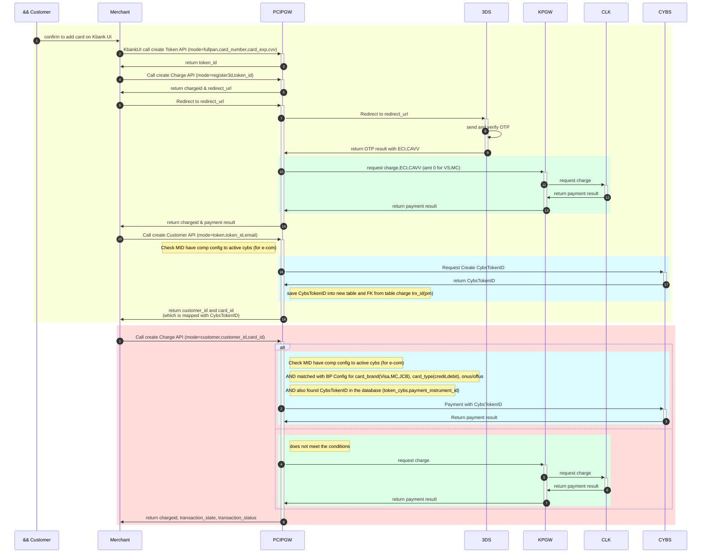
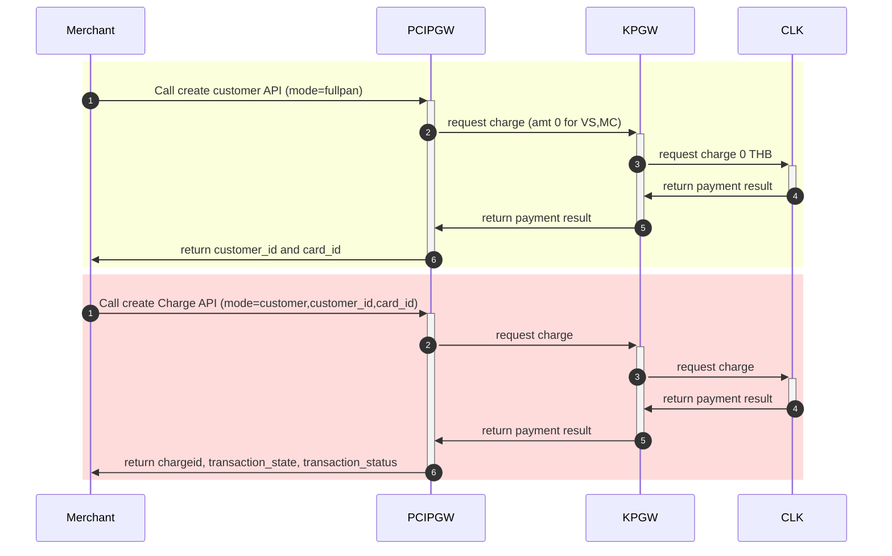
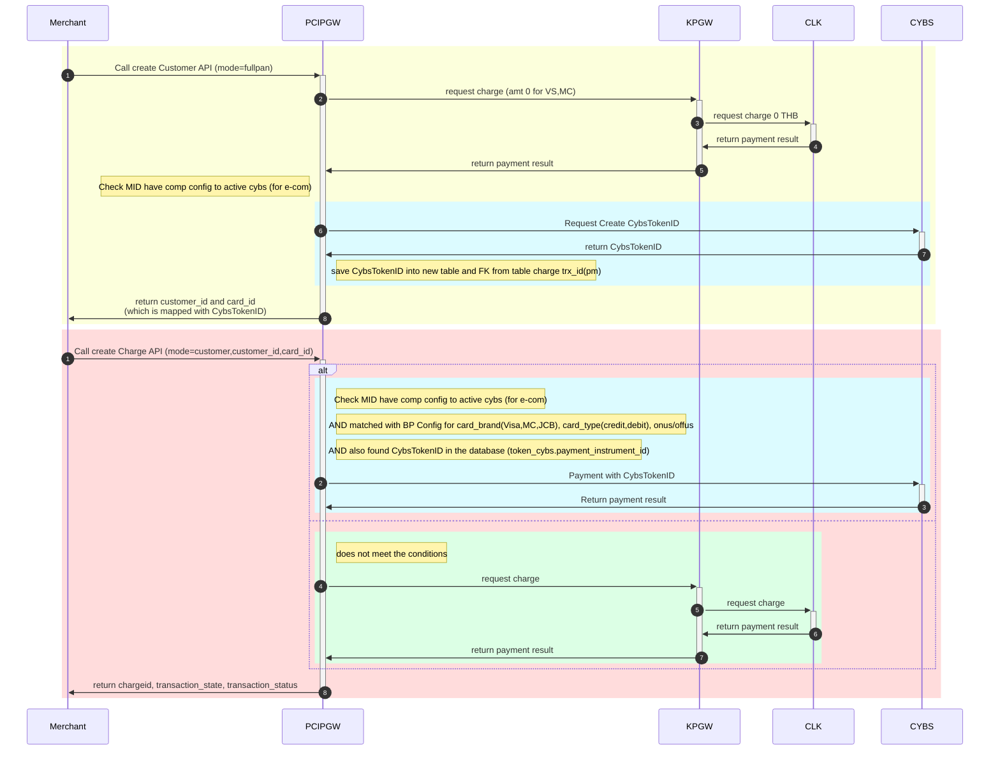
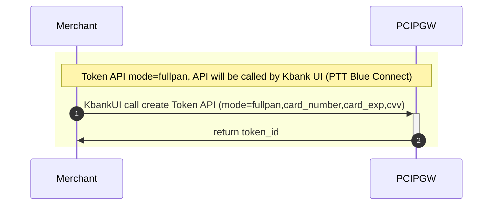
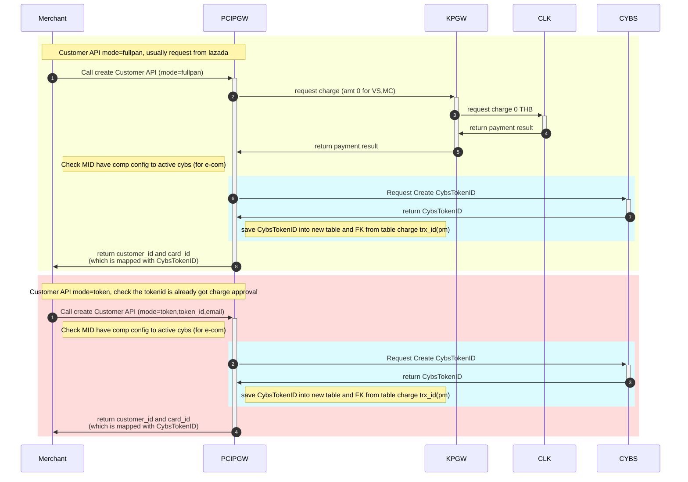
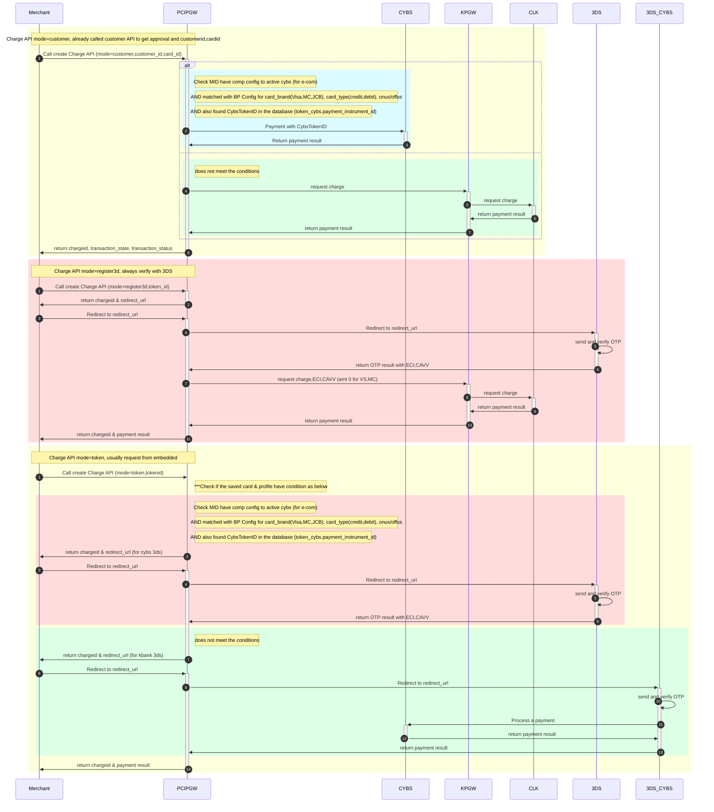

Pay and save with Embedded (as-is)

Pay and save with Embedded (to-be)

Add card (as-is)

Add card (to-be)

Create Customer (as-is)

Create Customer (to-be)

API - Create Token (Token Process)

API - Create Customer (Register Card)

API - Create Charge (Charge Process)

