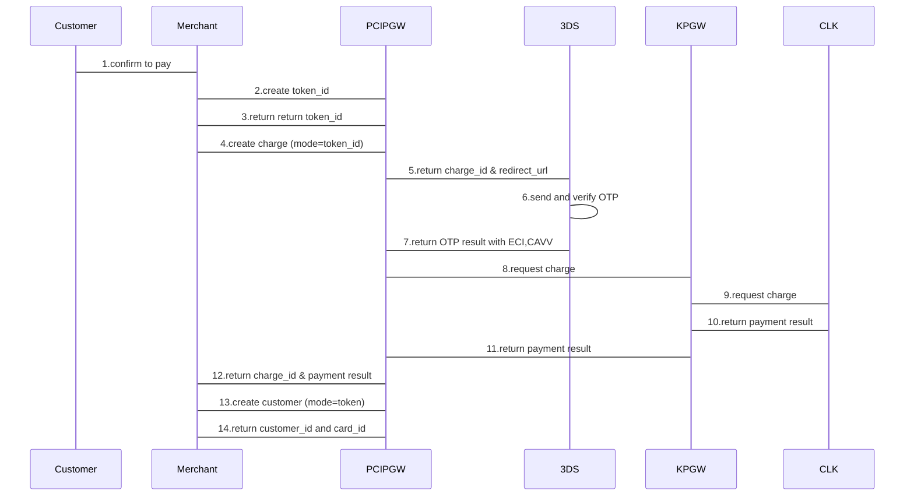
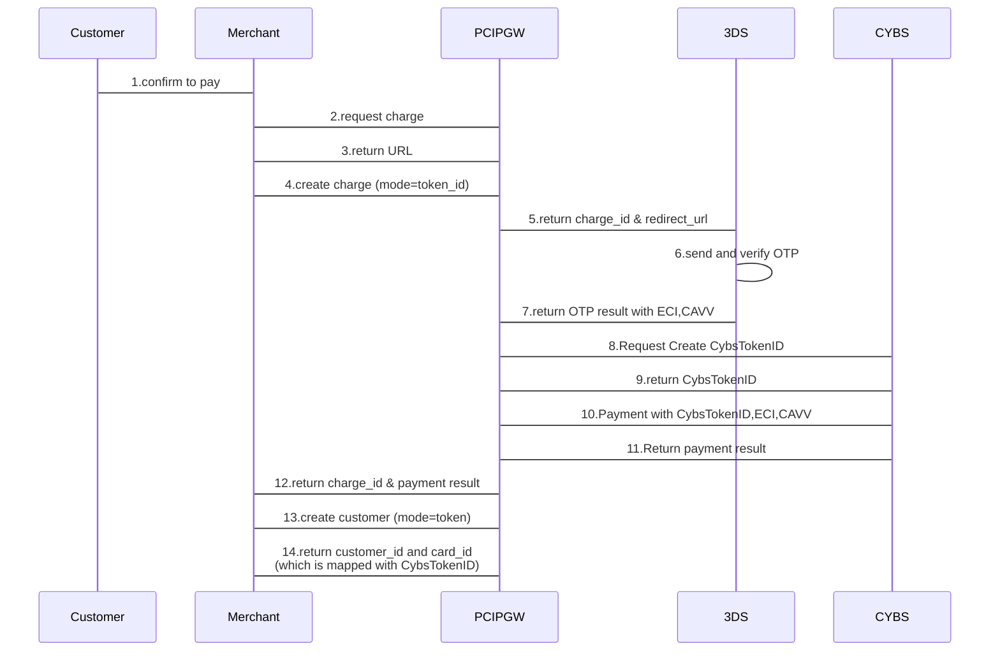
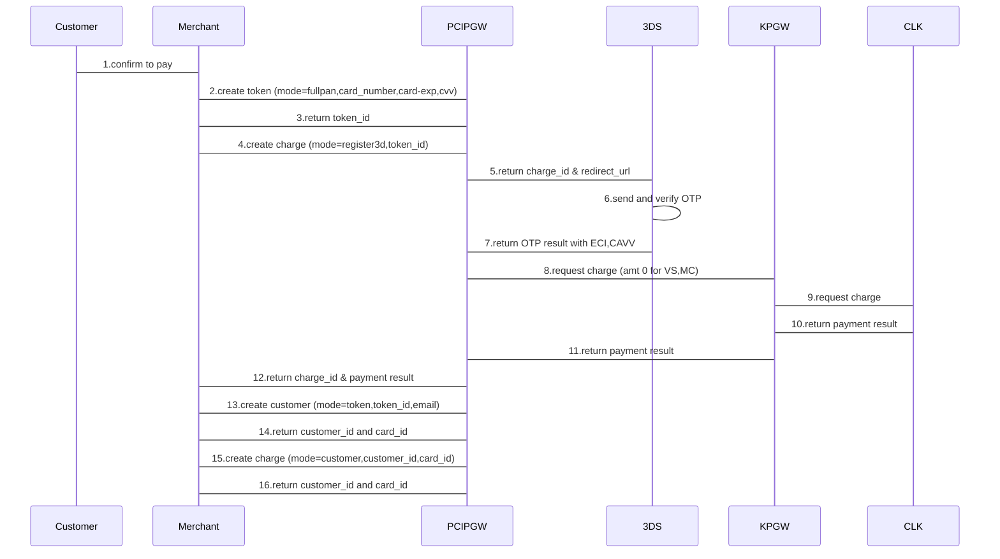
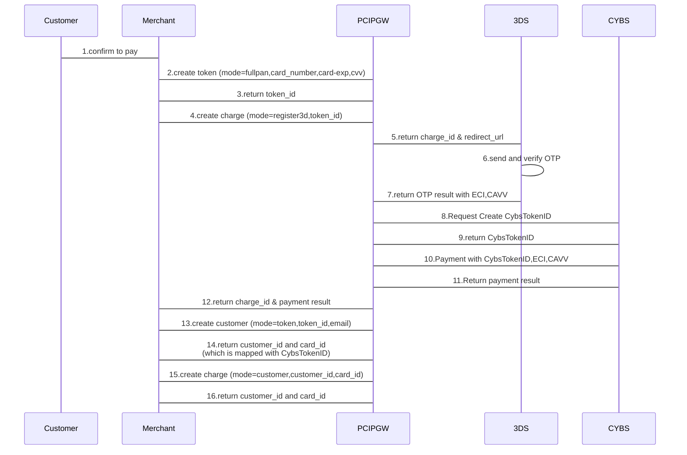

Pay and save with Embedded (as-is)

```mermaid
    sequenceDiagram
        Customer->Merchant:1.confirm to pay
        Merchant->PCIPGW:2.create token_id
        PCIPGW->Merchant:3.return return token_id
        Merchant->PCIPGW:4.create charge (mode=token_id)
        PCIPGW->3DS:5.return charge_id & redirect_url
        3DS->3DS:6.send and verify OTP
        3DS->PCIPGW:7.return OTP result with ECI,CAVV
        PCIPGW->KPGW:8.request charge
        KPGW->CLK:9.request charge
        CLK->KPGW:10.return payment result
        KPGW->PCIPGW:11.return payment result
        PCIPGW->Merchant:12.return charge_id & payment result

        Merchant->PCIPGW:13.create customer (mode=token)
        PCIPGW->Merchant:14.return customer_id and card_id

```

Pay and save with Embedded (Cybs)

```mermaid
    sequenceDiagram
        Customer->Merchant:1.confirm to pay
        Merchant->PCIPGW:2.request charge
        PCIPGW->Merchant:3.return URL
        Merchant->PCIPGW:4.create charge (mode=token_id)
        PCIPGW->3DS:5.return charge_id & redirect_url
        3DS->3DS:6.send and verify OTP
        3DS->PCIPGW:7.return OTP result with ECI,CAVV
        PCIPGW->CYBS:8.Request Create CybsTokenID
        CYBS->PCIPGW:9.return CybsTokenID
        PCIPGW->CYBS:10.Payment with CybsTokenID,ECI,CAVV
        CYBS->PCIPGW:11.Return payment result
        PCIPGW->Merchant:12.return charge_id & payment result

        Merchant->PCIPGW:13.create customer (mode=token)
        PCIPGW->Merchant:14.return customer_id and card_id <br>(which is mapped with CybsTokenID)

```

Add card (as-is)

```mermaid
    sequenceDiagram
        Customer->Merchant:1.confirm to pay
        Merchant->PCIPGW:2.create token (mode=fullpan,card_number,card-exp,cvv)
        PCIPGW->Merchant:3.return token_id
        Merchant->PCIPGW:4.create charge (mode=register3d,token_id)
        PCIPGW->3DS:5.return charge_id & redirect_url
        3DS->3DS:6.send and verify OTP
        3DS->PCIPGW:7.return OTP result with ECI,CAVV
        PCIPGW->KPGW:8.request charge (amt 0 for VS,MC)
        KPGW->CLK:9.request charge
        CLK->KPGW:10.return payment result
        KPGW->PCIPGW:11.return payment result
        PCIPGW->Merchant:12.return charge_id & payment result

        Merchant->PCIPGW:13.create customer (mode=token,token_id,email)
        PCIPGW->Merchant:14.return customer_id and card_id

        Merchant->PCIPGW:15.create charge (mode=customer,customer_id,card_id)
        PCIPGW->Merchant:16.return customer_id and card_id
```

Add card (Cybs)

```mermaid
    sequenceDiagram
        Customer->Merchant:1.confirm to pay
        Merchant->PCIPGW:2.create token (mode=fullpan,card_number,card-exp,cvv)
        PCIPGW->Merchant:3.return token_id
        Merchant->PCIPGW:4.create charge (mode=register3d,token_id)
        PCIPGW->3DS:5.return charge_id & redirect_url
        3DS->3DS:6.send and verify OTP
        3DS->PCIPGW:7.return OTP result with ECI,CAVV
        PCIPGW->CYBS:8.Request Create CybsTokenID
        CYBS->PCIPGW:9.return CybsTokenID
        PCIPGW->CYBS:10.Payment with CybsTokenID,ECI,CAVV
        CYBS->PCIPGW:11.Return payment result
        PCIPGW->Merchant:12.return charge_id & payment result

        Merchant->PCIPGW:13.create customer (mode=token,token_id,email)
        PCIPGW->Merchant:14.return customer_id and card_id <br>(which is mapped with CybsTokenID)

        Merchant->PCIPGW:15.create charge (mode=customer,customer_id,card_id)
        PCIPGW->Merchant:16.return customer_id and card_id
```
