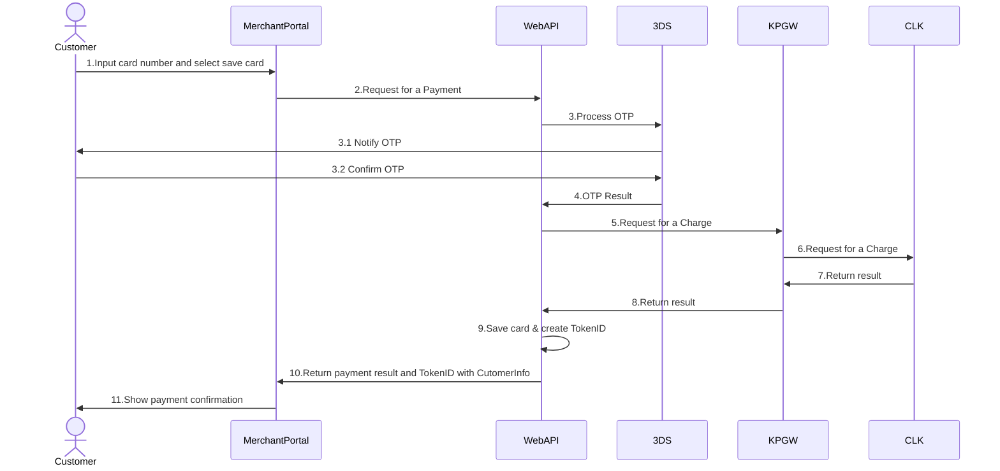

As-Is Pay Button

```mermaid
    sequenceDiagram
        Actor Customer
        participant MerchantPortal
        participant WebAPI
        participant 3DS
        participant KPGW
        participant CLK
        Customer->>MerchantPortal: 1.Input card number and select save card
        MerchantPortal->>WebAPI: 2.Request for a Payment
        WebAPI->>3DS: 3.Process OTP
        3DS->>Customer: 3.1 Notify OTP
        Customer->>3DS: 3.2 Confirm OTP
        3DS->>WebAPI: 4.OTP Result
        WebAPI->>KPGW: 5.Request for a Charge
        KPGW->>CLK: 6.Request for a Charge
        CLK->>KPGW: 7.Return result
        KPGW->>WebAPI: 8.Return result
        WebAPI->>WebAPI: 9.Save card & create TokenID
        WebAPI->>MerchantPortal: 10.Return payment result and TokenID with CutomerInfo
        MerchantPortal->>Customer: 11.Show payment confirmation
        
```
