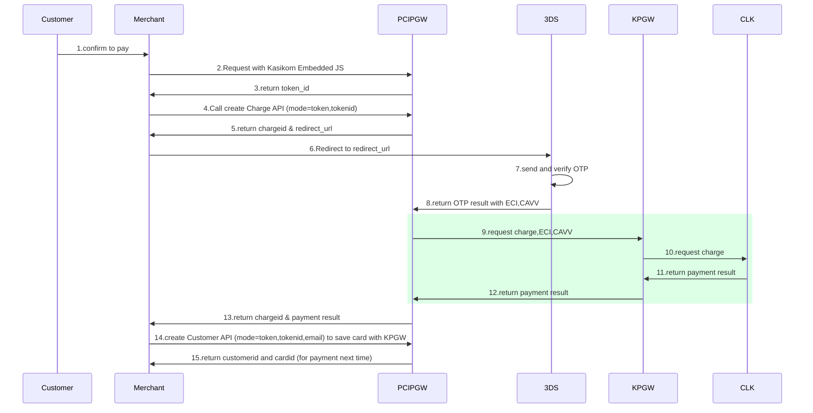
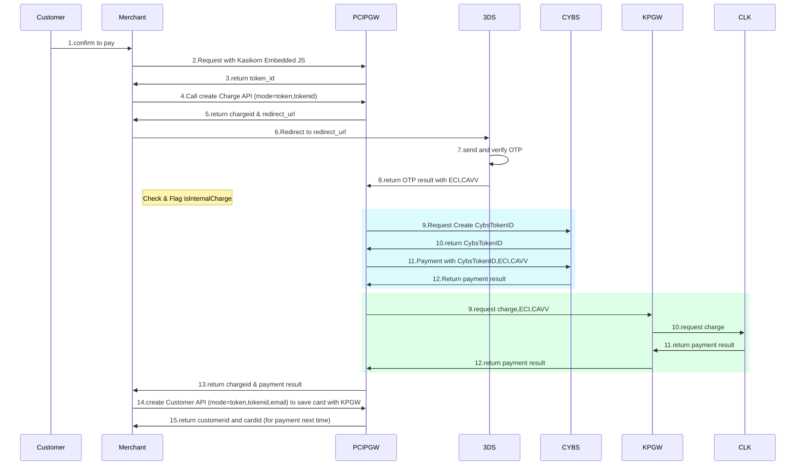
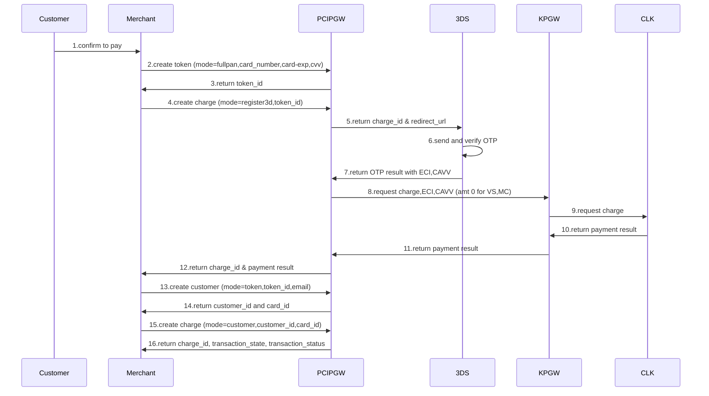
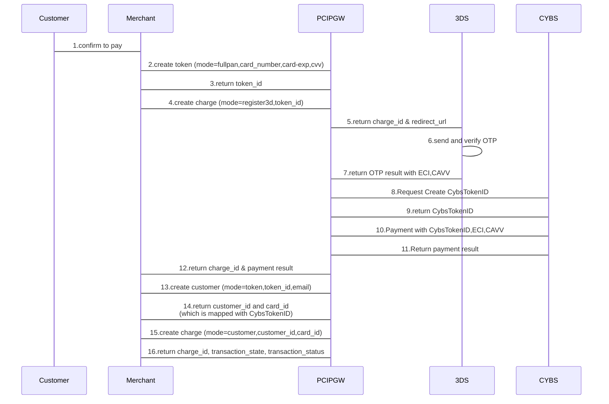
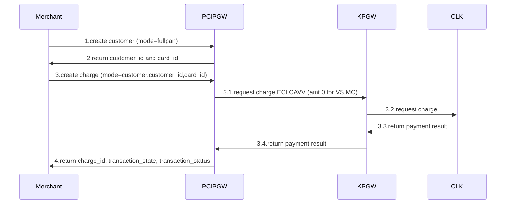
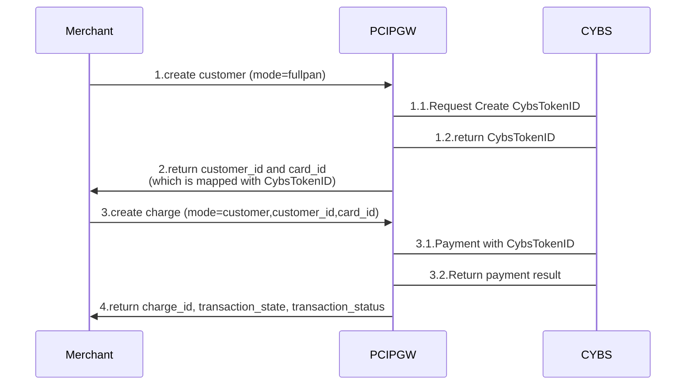

Pay and save with Embedded (as-is)

```mermaid
    sequenceDiagram
        Customer->>Merchant:1.confirm to pay
        Merchant->>PCIPGW:2.Request with Kasikorn Embedded JS
        PCIPGW->>Merchant:3.return token_id
        
        Merchant->>PCIPGW:4.Call create Charge API (mode=token,tokenid)
        PCIPGW->>Merchant:5.return chargeid & redirect_url
        
        
        Merchant->>3DS:6.Redirect to redirect_url
        3DS->>3DS:7.send and verify OTP
        3DS->>PCIPGW:8.return OTP result with ECI,CAVV
        
        rect rgb(220, 255, 229)
            PCIPGW->>KPGW:9.request charge,ECI,CAVV
            KPGW->>CLK:10.request charge
            CLK->>KPGW:11.return payment result
            KPGW->>PCIPGW:12.return payment result
        end
        
        PCIPGW->>Merchant:13.return chargeid & payment result

        Merchant->>PCIPGW:14.create Customer API (mode=token,tokenid,email) to save card with KPGW
        PCIPGW->>Merchant:15.return customerid and cardid (for payment next time)

```

Pay and save with Embedded (to-be)

```mermaid
    sequenceDiagram
        Customer->>Merchant:1.confirm to pay
        Merchant->>PCIPGW:2.Request with Kasikorn Embedded JS
        PCIPGW->>Merchant:3.return token_id
        Merchant->>PCIPGW:4.Call create Charge API (mode=token,tokenid)
        PCIPGW->>Merchant:5.return chargeid & redirect_url
        
        Merchant->>3DS:6.Redirect to redirect_url
        3DS->>3DS:7.send and verify OTP
        3DS->>PCIPGW:8.return OTP result with ECI,CAVV
            
        Note right of Merchant: Check & Flag isInternalCharge
        rect rgb(220, 251, 255)
            PCIPGW->>CYBS:9.Request Create CybsTokenID
            CYBS->>PCIPGW:10.return CybsTokenID
            PCIPGW->>CYBS:11.Payment with CybsTokenID,ECI,CAVV
            CYBS->>PCIPGW:12.Return payment result
        end
        
        rect rgb(220, 255, 229)
            PCIPGW->>KPGW:9.request charge,ECI,CAVV
            KPGW->>CLK:10.request charge
            CLK->>KPGW:11.return payment result
            KPGW->>PCIPGW:12.return payment result
        end
        
        PCIPGW->>Merchant:13.return chargeid & payment result

        Merchant->>PCIPGW:14.create Customer API (mode=token,tokenid,email) to save card with KPGW
        PCIPGW->>Merchant:15.return customerid and cardid (for payment next time)

```

Add card (as-is)

```mermaid
    sequenceDiagram
        Customer->>Merchant:1.confirm to pay
        Merchant->>PCIPGW:2.create token (mode=fullpan,card_number,card-exp,cvv)
        PCIPGW->>Merchant:3.return token_id
        Merchant->>PCIPGW:4.create charge (mode=register3d,token_id)
        PCIPGW->>3DS:5.return charge_id & redirect_url
        3DS->>3DS:6.send and verify OTP
        3DS->>PCIPGW:7.return OTP result with ECI,CAVV
        PCIPGW->>KPGW:8.request charge,ECI,CAVV (amt 0 for VS,MC)
        KPGW->>CLK:9.request charge
        CLK->>KPGW:10.return payment result
        KPGW->>PCIPGW:11.return payment result
        PCIPGW->>Merchant:12.return charge_id & payment result

        Merchant->>PCIPGW:13.create customer (mode=token,token_id,email)
        PCIPGW->>Merchant:14.return customer_id and card_id

        Merchant->>PCIPGW:15.create charge (mode=customer,customer_id,card_id)
        PCIPGW->>Merchant:16.return charge_id, transaction_state, transaction_status
```

Add card (Cybs)

```mermaid
    sequenceDiagram
        Customer->Merchant:1.confirm to pay
        Merchant->PCIPGW:2.create token (mode=fullpan,card_number,card-exp,cvv)
        PCIPGW->Merchant:3.return token_id
        Merchant->PCIPGW:4.create charge (mode=register3d,token_id)
        PCIPGW->3DS:5.return charge_id & redirect_url
        3DS->3DS:6.send and verify OTP
        3DS->PCIPGW:7.return OTP result with ECI,CAVV
        PCIPGW->CYBS:8.Request Create CybsTokenID
        CYBS->PCIPGW:9.return CybsTokenID
        PCIPGW->CYBS:10.Payment with CybsTokenID,ECI,CAVV
        CYBS->PCIPGW:11.Return payment result
        PCIPGW->Merchant:12.return charge_id & payment result

        Merchant->PCIPGW:13.create customer (mode=token,token_id,email)
        PCIPGW->Merchant:14.return customer_id and card_id <br>(which is mapped with CybsTokenID)

        Merchant->PCIPGW:15.create charge (mode=customer,customer_id,card_id)
        PCIPGW->Merchant:16.return charge_id, transaction_state, transaction_status
```

Create Customer (as-is)

```mermaid
    sequenceDiagram
        Merchant->>PCIPGW:1.create customer (mode=fullpan)
        PCIPGW->>Merchant:2.return customer_id and card_id

        Merchant->>PCIPGW:3.create charge (mode=customer,customer_id,card_id)
        PCIPGW->>KPGW:3.1.request charge,ECI,CAVV (amt 0 for VS,MC)
        KPGW->>CLK:3.2.request charge
        CLK->>KPGW:3.3.return payment result
        KPGW->>PCIPGW:3.4.return payment result
        PCIPGW->>Merchant:4.return charge_id, transaction_state, transaction_status
```

Create Customer (cybs)

```mermaid
    sequenceDiagram
        Merchant->>PCIPGW:1.create customer (mode=fullpan)
        PCIPGW->CYBS:1.1.Request Create CybsTokenID
        CYBS->PCIPGW:1.2.return CybsTokenID
        PCIPGW->>Merchant:2.return customer_id and card_id<br>(which is mapped with CybsTokenID)

        Merchant->>PCIPGW:3.create charge (mode=customer,customer_id,card_id)
        PCIPGW->CYBS:3.1.Payment with CybsTokenID
        CYBS->PCIPGW:3.2.Return payment result
        PCIPGW->>Merchant:4.return charge_id, transaction_state, transaction_status
```

