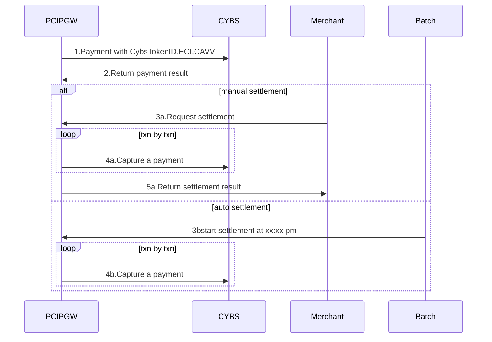
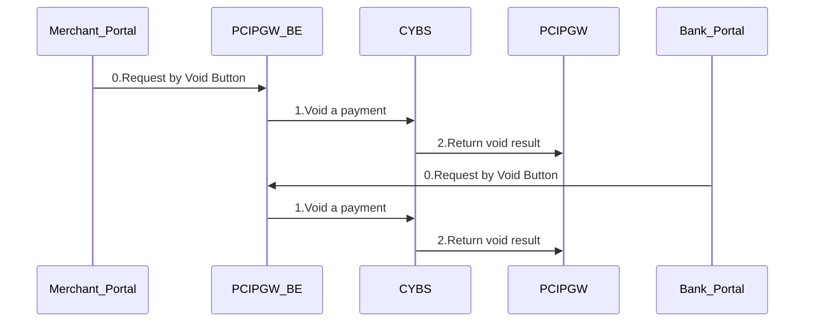

Settlement (cybs)



void (cybs)


Refund (cybs)
```mermaid
    sequenceDiagram
        Merchant_Portal->>PCIPGW_BE:0.Request by Refund Button
        PCIPGW_BE->>KPGW:1.Refund a settled transaction
        KPGW->>PCIPGW:2.Return Refund result
        
        Bank_Portal->>PCIPGW_BE:0.Request by Refund Button
        PCIPGW_BE->>KPGW:1.Refund a settled transaction
        KPGW->>PCIPGW:2.Return Refund result
        
        Note over Merchant_Portal,KPGW: KPGW batch job to process refund at xx:xx pm
        KPGW->>CLK:1.Request Refund
        CLK->>2.Return Refund result
```
