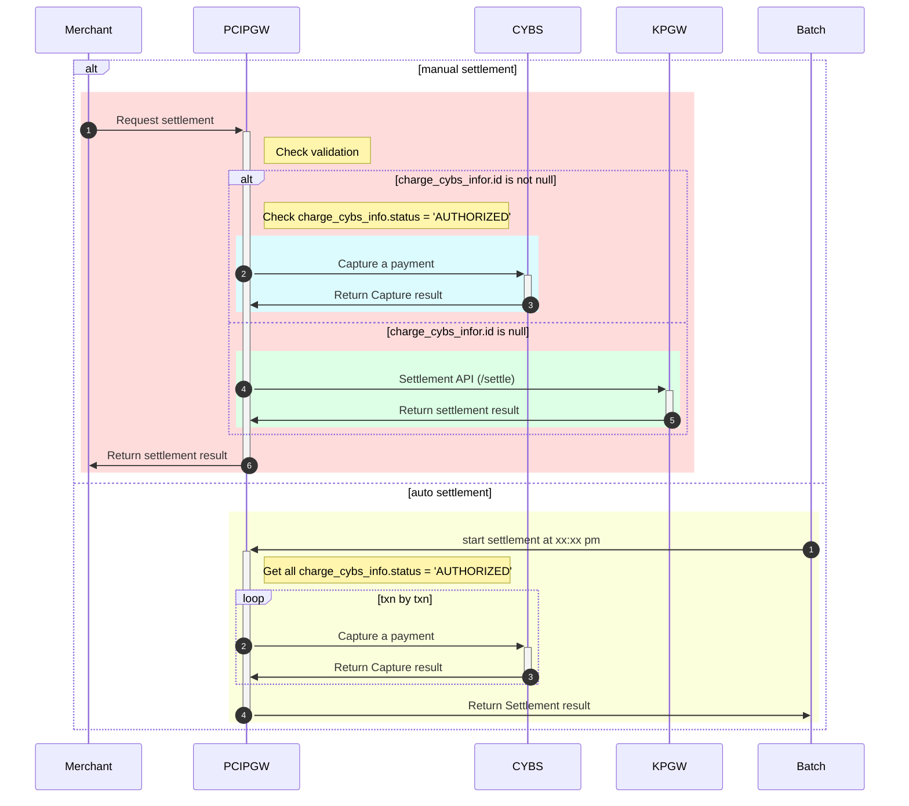
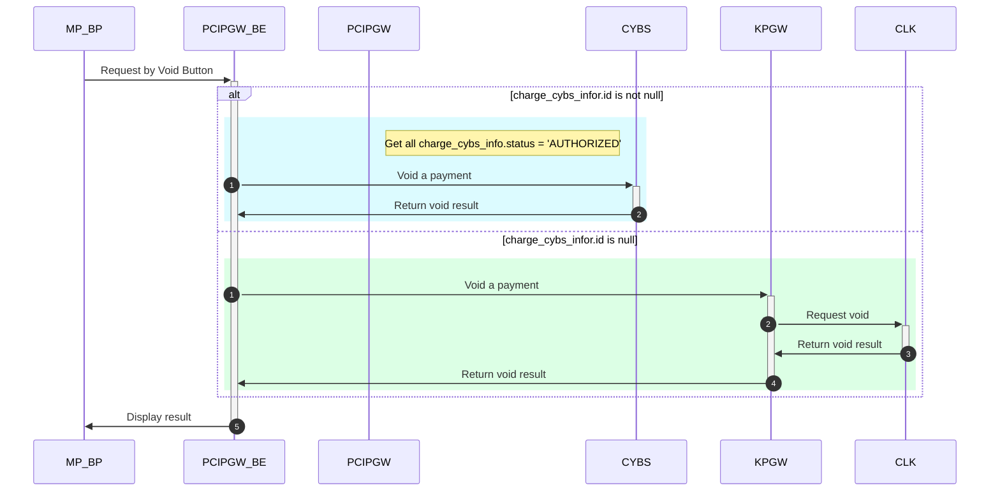
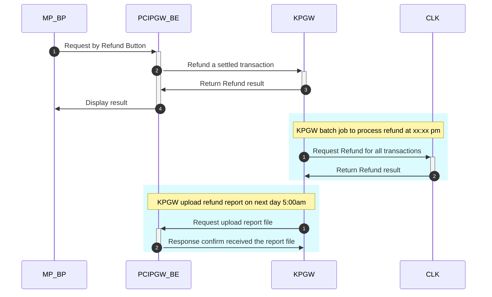

Settlement (to-be)

```mermaid
    sequenceDiagram  
        autonumber 1
        alt manual settlement
         rect rgb(255, 220, 220)
          Merchant->>+PCIPGW:Request settlement
          Note right of PCIPGW: Check validation
          %% loop txn by txn
          alt charge_cybs_infor.id is not null
            Note right of PCIPGW: Check charge_cybs_info.status = 'AUTHORIZED'
            rect rgb(220, 251, 255)
                PCIPGW->>+CYBS:Capture a payment
                CYBS->>-PCIPGW:Return Capture result
            end
          else charge_cybs_infor.id is null
            rect rgb(220, 255, 229)
                PCIPGW->>+KPGW:Settlement API (/settle)
                KPGW->>-PCIPGW:Return settlement result
            end
          end
          %% end
          PCIPGW->>-Merchant:Return settlement result
         end
        else auto settlement
         rect rgb(252, 255, 220)
         autonumber 1
          Batch->>+PCIPGW:start settlement at xx:xx pm
          Note right of PCIPGW: Get all charge_cybs_info.status = 'AUTHORIZED'
          loop txn by txn
            PCIPGW->>+CYBS:Capture a payment
            CYBS->>-PCIPGW:Return Capture result
          end
          PCIPGW->>-Batch:Return Settlement result
         end
        end
```

void (to-be)

```mermaid
    sequenceDiagram
        MP_BP->>+PCIPGW_BE:Request by Void Button
        alt charge_cybs_infor.id is not null
            rect rgb(220, 251, 255)
                Note right of PCIPGW: Get all charge_cybs_info.status = 'AUTHORIZED'
                autonumber 1
                PCIPGW_BE->>+CYBS:Void a payment
                CYBS->>-PCIPGW_BE:Return void result
            end
        else charge_cybs_infor.id is null
            rect rgb(220, 255, 229)
                autonumber 1
                PCIPGW_BE->>+KPGW:Void a payment
                KPGW->>+CLK:Request void
                CLK->>-KPGW:Return void result
                KPGW->>-PCIPGW_BE:Return void result
            end
        end
        PCIPGW_BE->>-MP_BP:Display result
```

Refund (to-be)

```mermaid
    sequenceDiagram
        autonumber 1
        MP_BP->>+PCIPGW_BE:Request by Refund Button
        PCIPGW_BE->>+KPGW:Refund a settled transaction
        KPGW->>-PCIPGW_BE:Return Refund result
        PCIPGW_BE->>-MP_BP:Display result
        
        rect rgb(220, 251, 255)
            autonumber 1
            Note over KPGW,CLK: KPGW batch job to process refund at xx:xx pm
            KPGW->>+CLK:Request Refund for all transactions
            CLK->>-KPGW:Return Refund result
        end
        rect rgb(220, 251, 255)
            autonumber 1
            Note over PCIPGW_BE,KPGW: KPGW upload refund report on next day 5:00am
            KPGW->>+PCIPGW_BE:Request upload report file
            PCIPGW_BE->>-KPGW:Response confirm received the report file
        end
```
