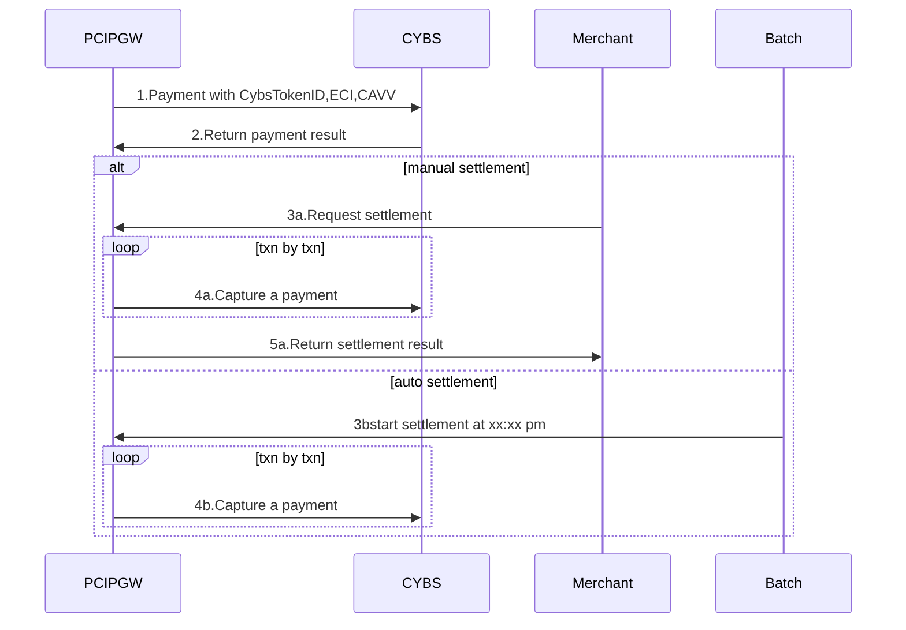
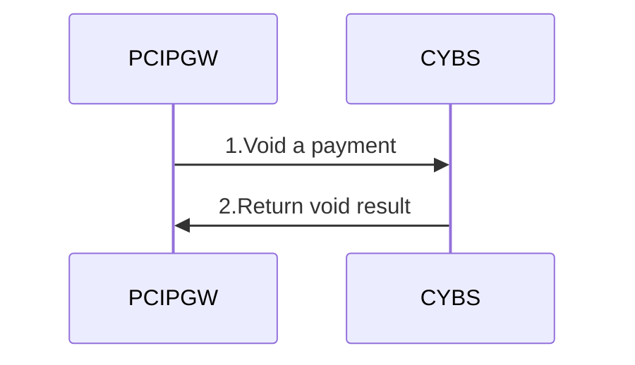

Settlement (cybs)

```mermaid
    sequenceDiagram
        PCIPGW->>CYBS:1.Payment with CybsTokenID,ECI,CAVV
        CYBS->>PCIPGW:2.Return payment result
        
        alt manual settlement
          Merchant->>PCIPGW:3a.Request settlement
          loop txn by txn
            PCIPGW->>CYBS:4a.Capture a payment
          end
          PCIPGW->>Merchant:5a.Return settlement result
        else auto settlement
          Batch->>PCIPGW:3bstart settlement at xx:xx pm
          loop txn by txn
            PCIPGW->>CYBS:4b.Capture a payment
          end
        end
```

void (cybs)

```mermaid
    sequenceDiagram
        PCIPGW->>CYBS:1.Void a payment
        CYBS->>PCIPGW:2.Return void result
```
