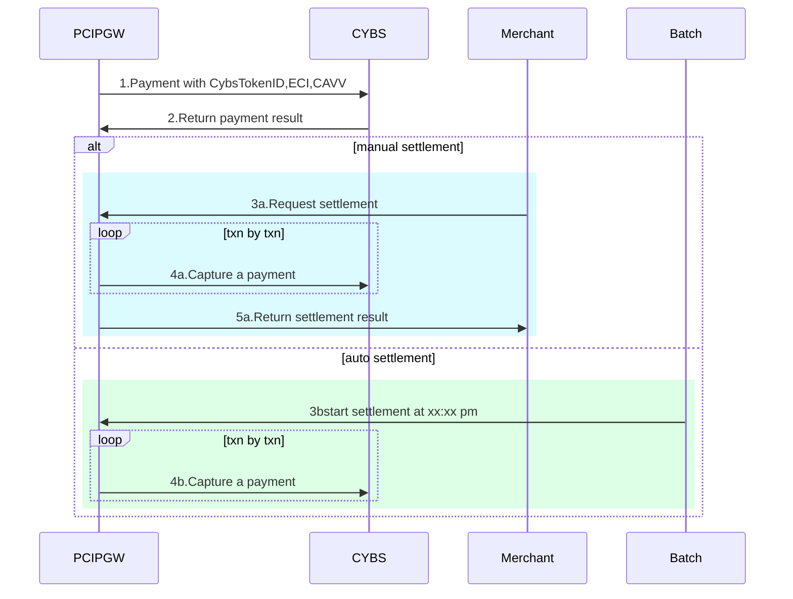
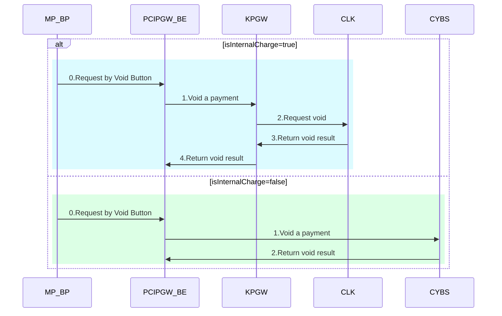
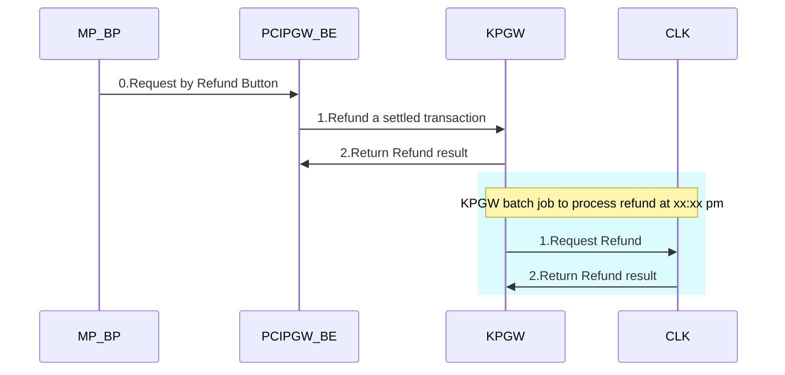

Settlement (cybs)

```mermaid
    sequenceDiagram
        PCIPGW->>CYBS:1.Payment with CybsTokenID,ECI,CAVV
        CYBS->>PCIPGW:2.Return payment result
        
        alt manual settlement
         rect rgb(220, 251, 255)
          Merchant->>PCIPGW:3a.Request settlement
          loop txn by txn
            PCIPGW->>CYBS:4a.Capture a payment
          end
          PCIPGW->>Merchant:5a.Return settlement result
         end
        else auto settlement
         rect rgb(220, 255, 229)
          Batch->>PCIPGW:3bstart settlement at xx:xx pm
          loop txn by txn
            PCIPGW->>CYBS:4b.Capture a payment
          end
         end
        end
```

void (cybs)

```mermaid
    sequenceDiagram
        alt isInternalCharge=true
            rect rgb(220, 251, 255)
                MP_BP->>PCIPGW_BE:0.Request by Void Button
                PCIPGW_BE->>KPGW:1.Void a payment
                KPGW->>CLK:2.Request void
                CLK->>KPGW:3.Return void result
                KPGW->>PCIPGW_BE:4.Return void result
            end
        else isInternalCharge=false
            rect rgb(220, 255, 229)
                MP_BP->>PCIPGW_BE:0.Request by Void Button
                PCIPGW_BE->>CYBS:1.Void a payment
                CYBS->>PCIPGW_BE:2.Return void result
            end
        end
```

Refund (cybs)

```mermaid
    sequenceDiagram
        MP_BP->>PCIPGW_BE:0.Request by Refund Button
        PCIPGW_BE->>KPGW:1.Refund a settled transaction
        KPGW->>PCIPGW_BE:2.Return Refund result
        rect rgb(220, 251, 255)
            Note over KPGW,CLK: KPGW batch job to process refund at xx:xx pm
            KPGW->>CLK:1.Request Refund
            CLK->>KPGW:2.Return Refund result
        end
```
