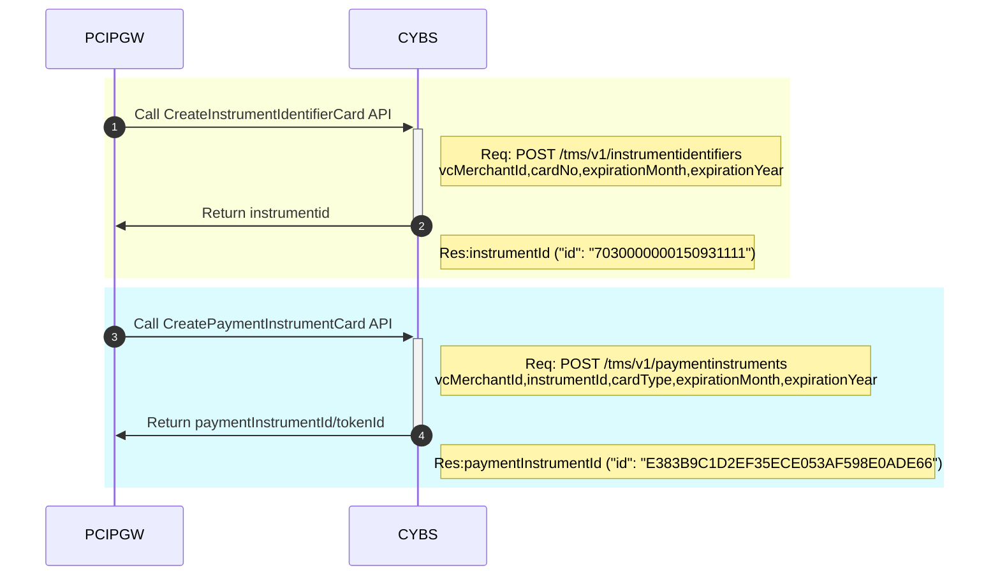
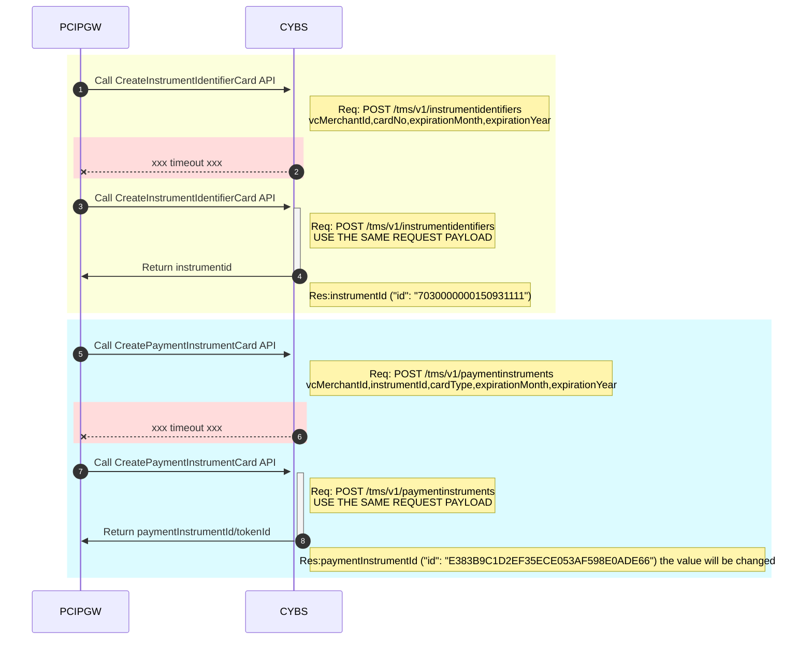
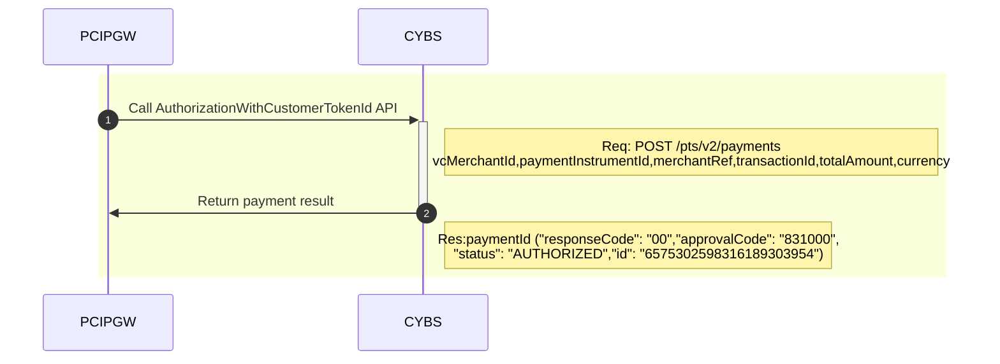
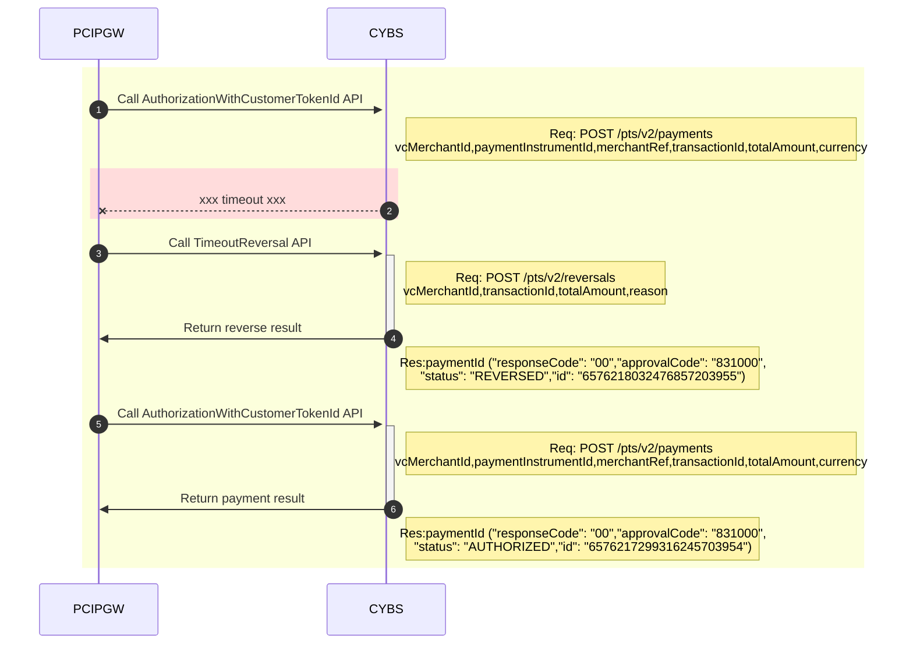
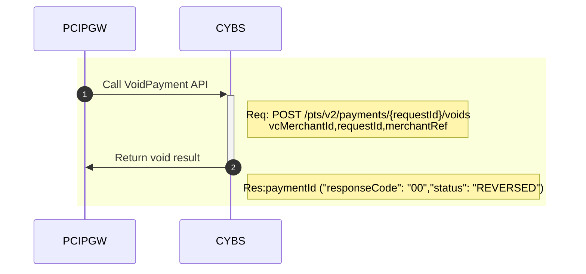
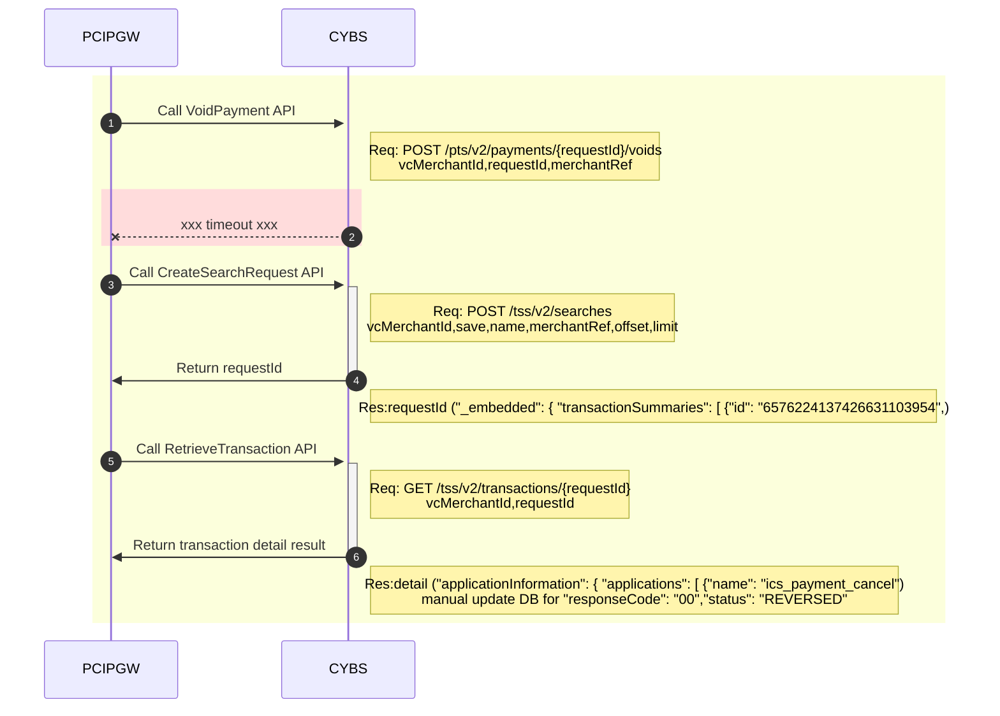
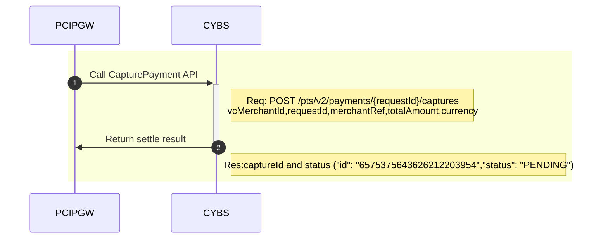
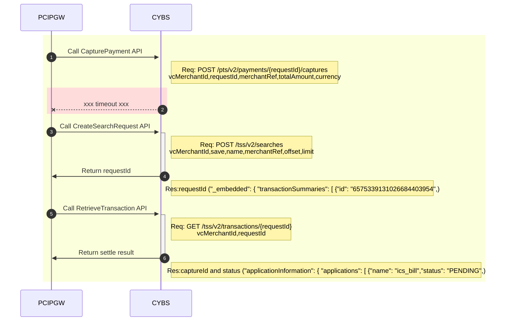

To Get CybsTokenID

To Get CybsTokenID (timeout)

Process a Payment

Process a Payment (timeout)

Void a Payment

Void a Payment (timeout)

Capture a Payment

Capture a Payment (timeout)

STATUS:
AUTHORIZED => payment approval
PENDING => captured/settled
REVERSED => voided/reversed

RequestID:
payment_request_id
capture_request_id
reverse_request_id
