To Get CybsTokenID (New DB Table token_cybs.payment_instrument_id)
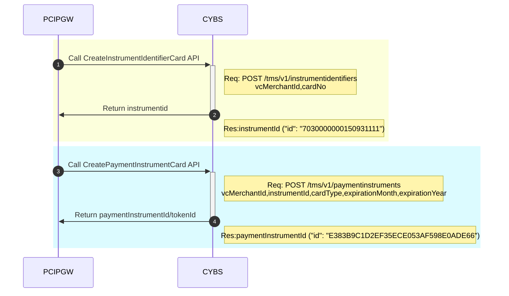

To Get CybsTokenID (timeout)
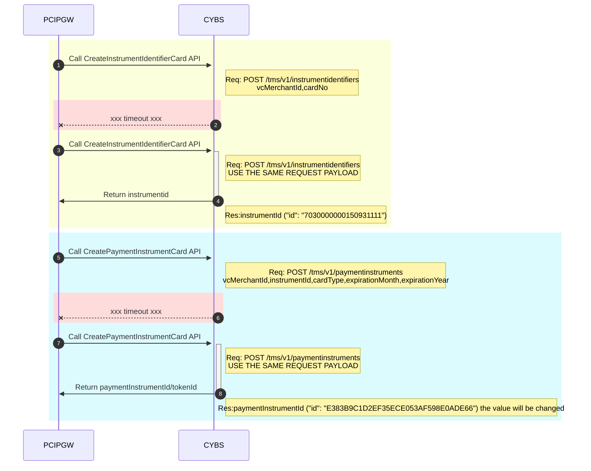

Process a Payment
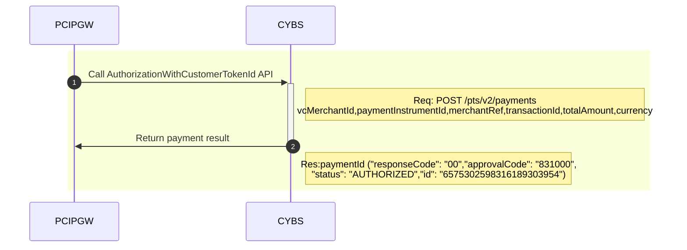

Process a Payment (timeout)
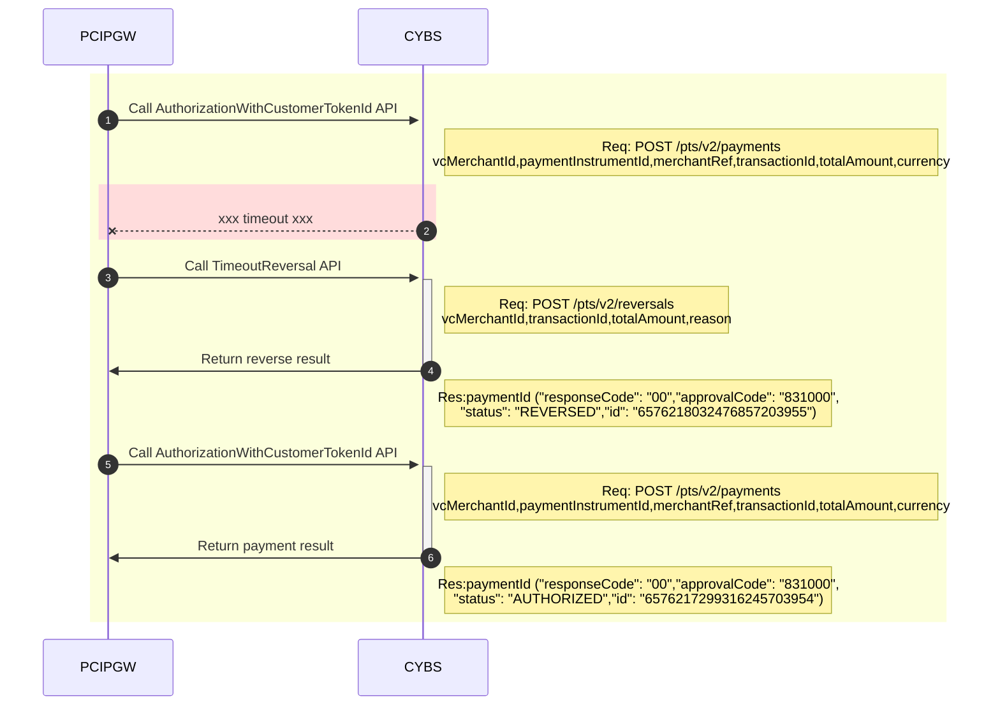

Process a Payment 3DS - Old Solution, Don't use
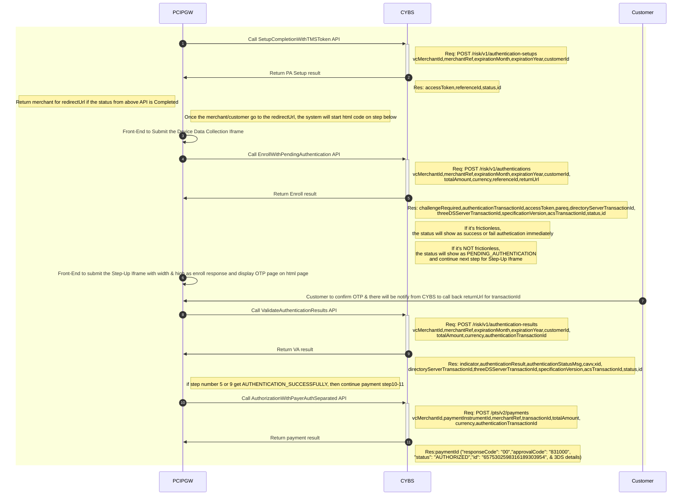

Process a Payment 3DS (timeout) - Old Solution, Don't use
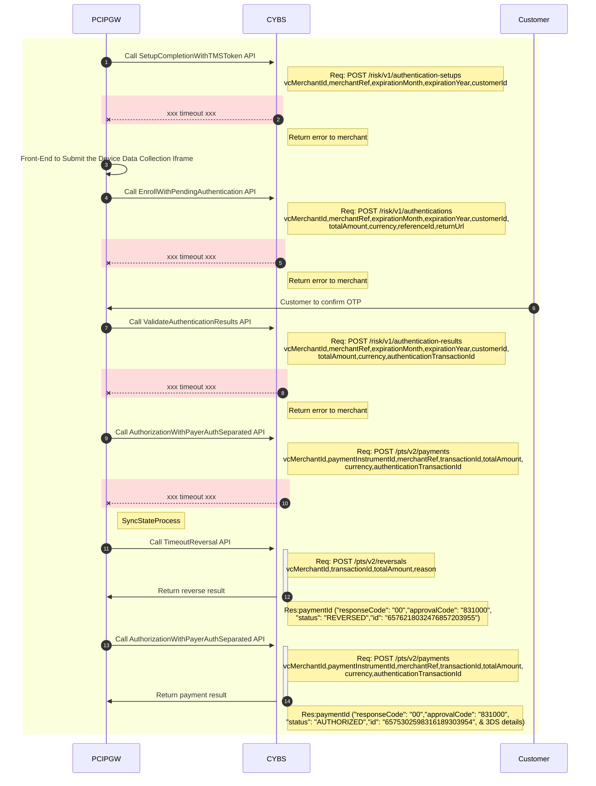

Process a Payment 3DS - New Solution 20220905
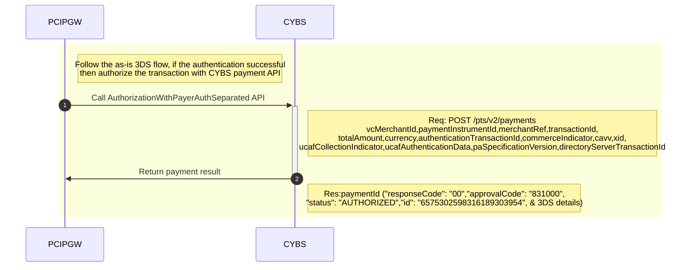

Process a Payment 3DS (timeout) - New Solution 20220905

Void a Payment
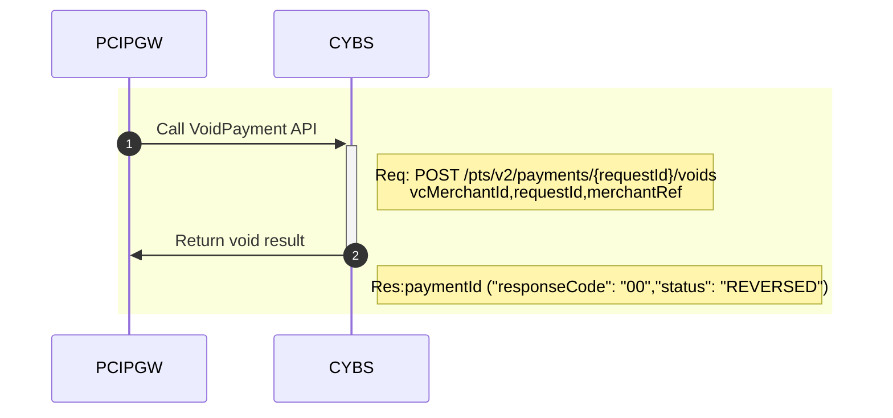

Void a Payment (timeout)
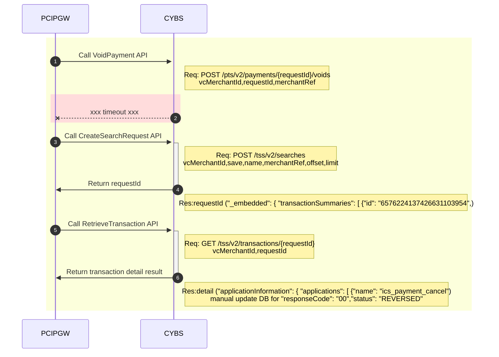

Capture a Payment
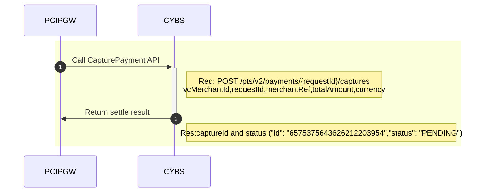

Capture a Payment (timeout)
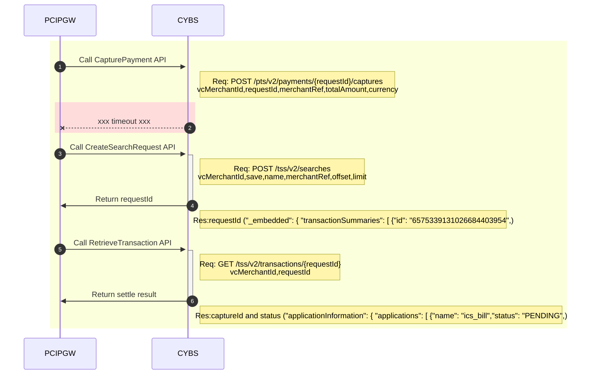

STATUS:
AUTHORIZED => payment approval,
PENDING => captured/settled,
REVERSED => voided/reversed

RequestID:
payment_request_id,
capture_request_id,
reverse_request_id
