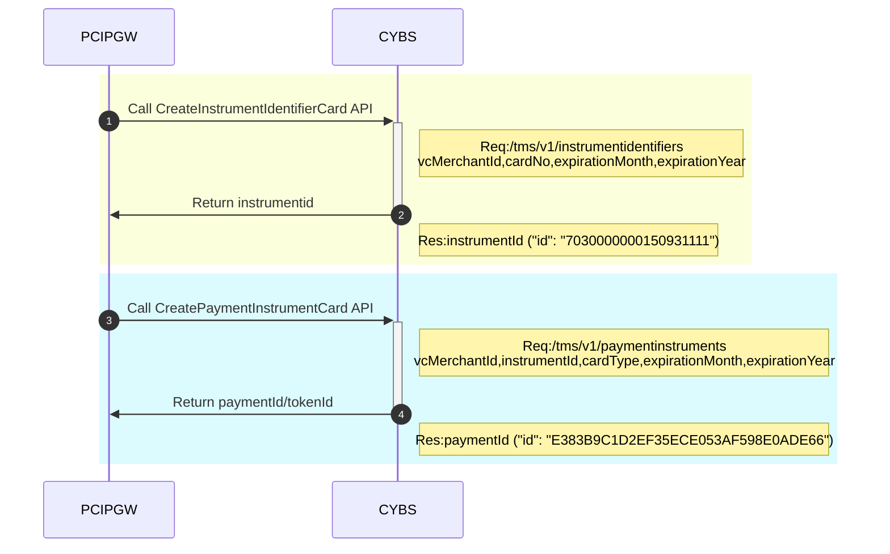
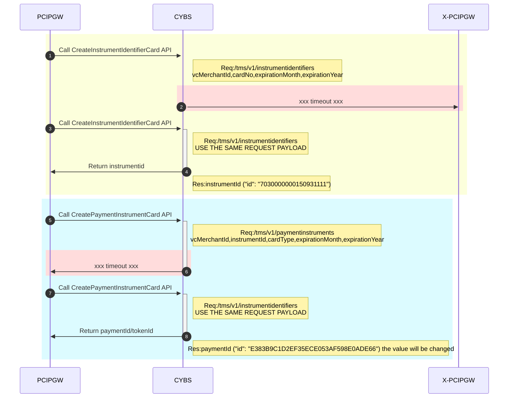

To Get CybsTokenID

```mermaid
    sequenceDiagram
    autonumber
        rect rgb(252, 255, 220)
            PCIPGW->>+CYBS:Call CreateInstrumentIdentifierCard API
            Note right of CYBS: Req:/tms/v1/instrumentidentifiers<br>vcMerchantId,cardNo,expirationMonth,expirationYear
            CYBS->>-PCIPGW:Return instrumentid
            Note right of CYBS: Res:instrumentId ("id": "7030000000150931111")
        end
        rect rgb(220, 251, 255)
            PCIPGW->>+CYBS:Call CreatePaymentInstrumentCard API
            Note right of CYBS: Req:/tms/v1/paymentinstruments<br>vcMerchantId,instrumentId,cardType,expirationMonth,expirationYear
            CYBS->>-PCIPGW:Return paymentId/tokenId
            Note right of CYBS: Res:paymentId ("id": "E383B9C1D2EF35ECE053AF598E0ADE66")
        end
```

To Get CybsTokenID (timeout)

```mermaid
    sequenceDiagram
    autonumber
        rect rgb(252, 255, 220)
            PCIPGW->>+CYBS: Call CreateInstrumentIdentifierCard API
            Note right of CYBS: Req:/tms/v1/instrumentidentifiers<br>vcMerchantId,cardNo,expirationMonth,expirationYear
            rect rgb(255, 220, 220)
              CYBS->>X-PCIPGW: xxx timeout xxx
            end
            PCIPGW->>+CYBS: Call CreateInstrumentIdentifierCard API
            Note right of CYBS: Req:/tms/v1/instrumentidentifiers<br>USE THE SAME REQUEST PAYLOAD
            CYBS->>-PCIPGW:Return instrumentid
            Note right of CYBS: Res:instrumentId ("id": "7030000000150931111")
        end
        
        rect rgb(220, 251, 255)
            PCIPGW->>+CYBS: Call CreatePaymentInstrumentCard API
            Note right of CYBS: Req:/tms/v1/paymentinstruments<br>vcMerchantId,instrumentId,cardType,expirationMonth,expirationYear
            rect rgb(255, 220, 220)
              CYBS->>-PCIPGW: xxx timeout xxx
            end
            PCIPGW->>+CYBS: Call CreatePaymentInstrumentCard API
            Note right of CYBS: Req:/tms/v1/instrumentidentifiers<br>USE THE SAME REQUEST PAYLOAD
            CYBS->>-PCIPGW: Return paymentId/tokenId
            Note right of CYBS: Res:paymentId ("id": "E383B9C1D2EF35ECE053AF598E0ADE66") the value will be changed
        end
```
