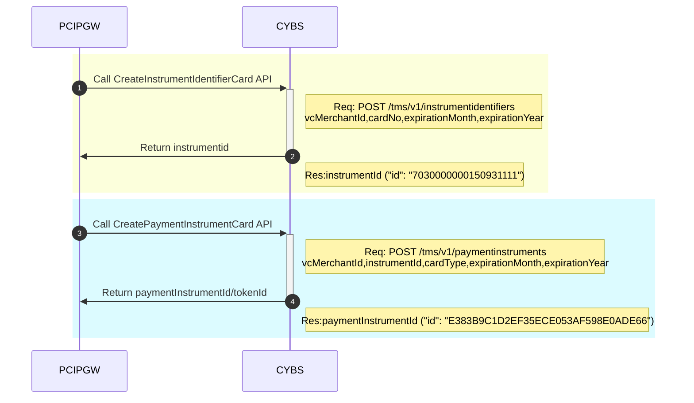
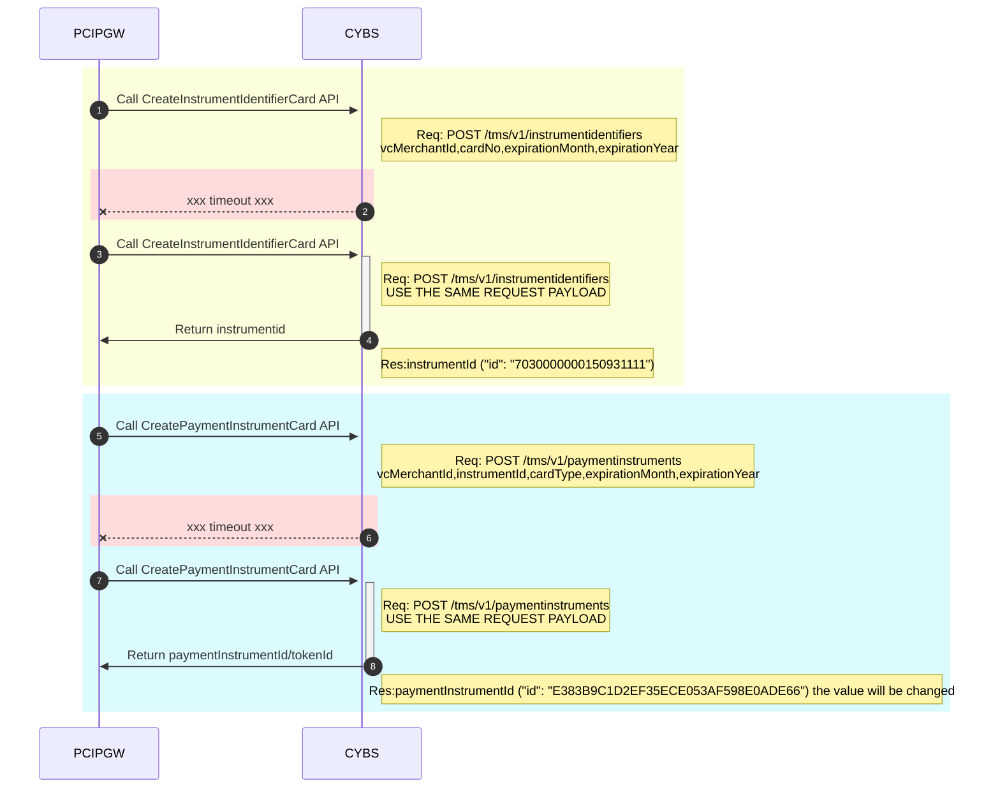
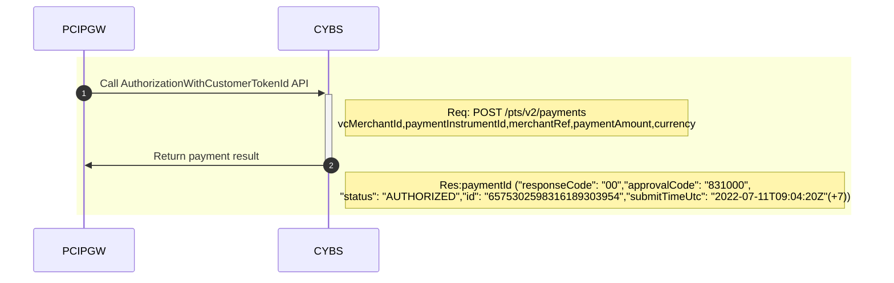
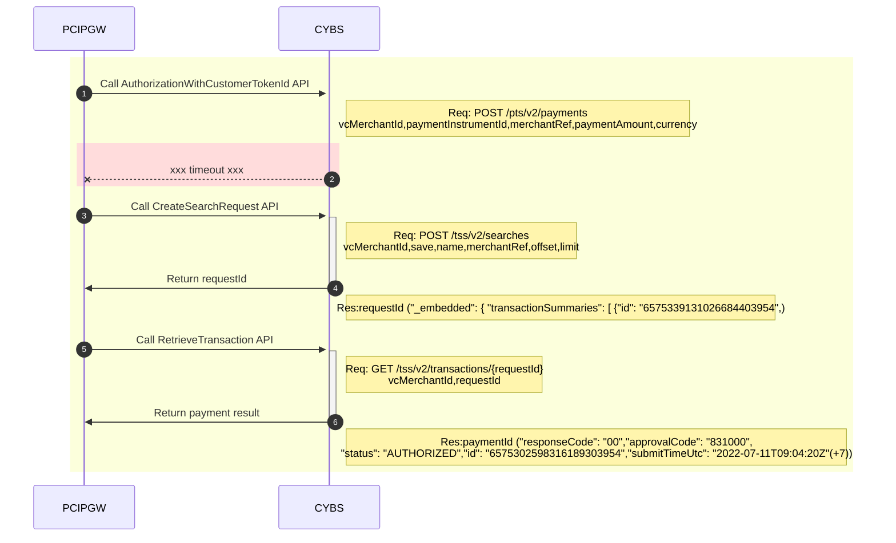
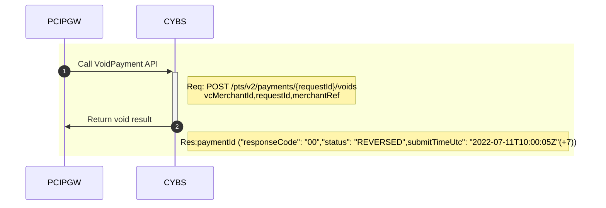
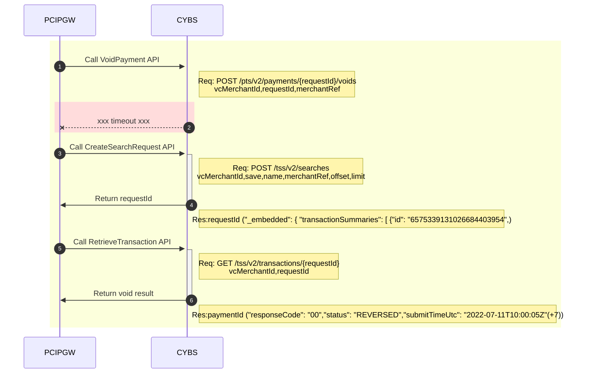
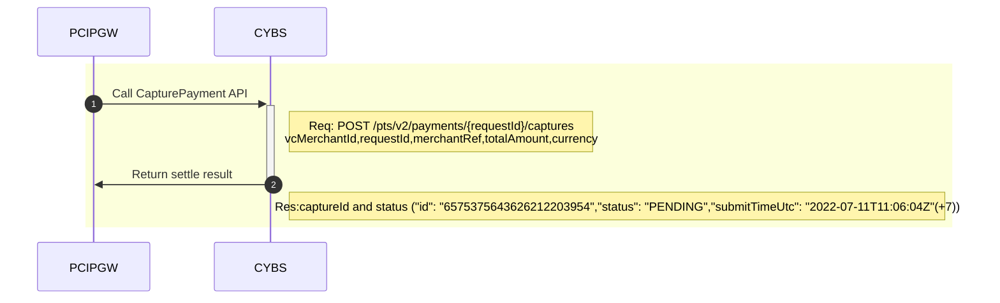
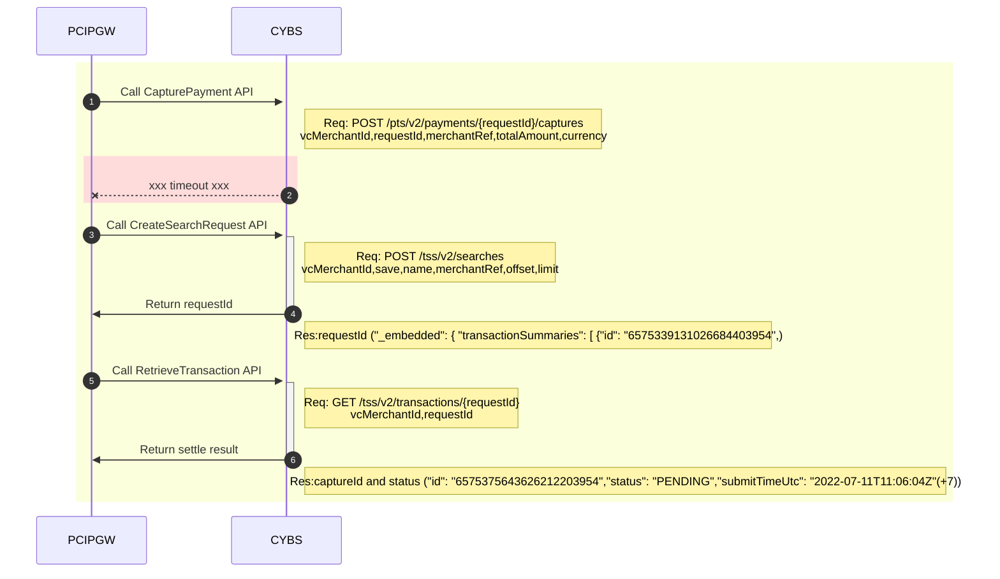

To Get CybsTokenID

```mermaid
    sequenceDiagram
    autonumber
        rect rgb(252, 255, 220)
            PCIPGW->>+CYBS:Call CreateInstrumentIdentifierCard API
            Note right of CYBS: Req: POST /tms/v1/instrumentidentifiers<br>vcMerchantId,cardNo,expirationMonth,expirationYear
            CYBS->>-PCIPGW:Return instrumentid
            Note right of CYBS: Res:instrumentId ("id": "7030000000150931111")
        end
        rect rgb(220, 251, 255)
            PCIPGW->>+CYBS:Call CreatePaymentInstrumentCard API
            Note right of CYBS: Req: POST /tms/v1/paymentinstruments<br>vcMerchantId,instrumentId,cardType,expirationMonth,expirationYear
            CYBS->>-PCIPGW:Return paymentInstrumentId/tokenId
            Note right of CYBS: Res:paymentInstrumentId ("id": "E383B9C1D2EF35ECE053AF598E0ADE66")
        end
```

To Get CybsTokenID (timeout)

```mermaid
    sequenceDiagram
    autonumber
        rect rgb(252, 255, 220)
            PCIPGW->>+CYBS: Call CreateInstrumentIdentifierCard API
            Note right of CYBS: Req: POST /tms/v1/instrumentidentifiers<br>vcMerchantId,cardNo,expirationMonth,expirationYear
            rect rgb(255, 220, 220)
              CYBS--XPCIPGW: xxx timeout xxx
            end
            PCIPGW->>+CYBS: Call CreateInstrumentIdentifierCard API
            Note right of CYBS: Req: POST /tms/v1/instrumentidentifiers<br>USE THE SAME REQUEST PAYLOAD
            CYBS->>-PCIPGW:Return instrumentid
            Note right of CYBS: Res:instrumentId ("id": "7030000000150931111")
        end
        
        rect rgb(220, 251, 255)
            PCIPGW->>+CYBS: Call CreatePaymentInstrumentCard API
            Note right of CYBS: Req: POST /tms/v1/paymentinstruments<br>vcMerchantId,instrumentId,cardType,expirationMonth,expirationYear
            rect rgb(255, 220, 220)
              CYBS--XPCIPGW: xxx timeout xxx
            end
            PCIPGW->>+CYBS: Call CreatePaymentInstrumentCard API
            Note right of CYBS: Req: POST /tms/v1/paymentinstruments<br>USE THE SAME REQUEST PAYLOAD
            CYBS->>-PCIPGW: Return paymentInstrumentId/tokenId
            Note right of CYBS: Res:paymentInstrumentId ("id": "E383B9C1D2EF35ECE053AF598E0ADE66") the value will be changed
        end
```

Process a Payment

```mermaid
    sequenceDiagram
    autonumber
        rect rgb(252, 255, 220)
            PCIPGW->>+CYBS:Call AuthorizationWithCustomerTokenId API
            Note right of CYBS: Req: POST /pts/v2/payments<br>vcMerchantId,paymentInstrumentId,merchantRef,paymentAmount,currency
            CYBS->>-PCIPGW:Return payment result
            Note right of CYBS: Res:paymentId ("responseCode": "00","approvalCode": "831000",<BR>"status": "AUTHORIZED","id": "6575302598316189303954","submitTimeUtc": "2022-07-11T09:04:20Z"(+7))
        end
```

Process a Payment (timeout)

```mermaid
    sequenceDiagram
    autonumber
        rect rgb(252, 255, 220)
            PCIPGW->>+CYBS:Call AuthorizationWithCustomerTokenId API
            Note right of CYBS: Req: POST /pts/v2/payments<br>vcMerchantId,paymentInstrumentId,merchantRef,paymentAmount,currency
            rect rgb(255, 220, 220)
              CYBS--XPCIPGW: xxx timeout xxx
            end
            PCIPGW->>+CYBS:Call CreateSearchRequest API
            Note right of CYBS: Req: POST /tss/v2/searches<br>vcMerchantId,save,name,merchantRef,offset,limit
            CYBS->>-PCIPGW:Return requestId
            Note right of CYBS: Res:requestId ("_embedded": { "transactionSummaries": [ {"id": "6575339131026684403954",)
            PCIPGW->>+CYBS:Call RetrieveTransaction API
            Note right of CYBS: Req: GET /tss/v2/transactions/{requestId}<br>vcMerchantId,requestId
            CYBS->>-PCIPGW:Return payment result
            Note right of CYBS: Res:paymentId ("responseCode": "00","approvalCode": "831000",<BR>"status": "AUTHORIZED","id": "6575302598316189303954","submitTimeUtc": "2022-07-11T09:04:20Z"(+7))
        end
```

Void a Payment

```mermaid
    sequenceDiagram
    autonumber
        rect rgb(252, 255, 220)
            PCIPGW->>+CYBS:Call VoidPayment API
            Note right of CYBS: Req: POST /pts/v2/payments/{requestId}/voids<br>vcMerchantId,requestId,merchantRef
            CYBS->>-PCIPGW:Return void result
            Note right of CYBS: Res:paymentId ("responseCode": "00","status": "REVERSED",submitTimeUtc": "2022-07-11T10:00:05Z"(+7))
        end
```

Void a Payment (timeout)

```mermaid
    sequenceDiagram
    autonumber
        rect rgb(252, 255, 220)
            PCIPGW->>+CYBS:Call VoidPayment API
            Note right of CYBS: Req: POST /pts/v2/payments/{requestId}/voids<br>vcMerchantId,requestId,merchantRef
            rect rgb(255, 220, 220)
              CYBS--XPCIPGW: xxx timeout xxx
            end
            PCIPGW->>+CYBS:Call CreateSearchRequest API
            Note right of CYBS: Req: POST /tss/v2/searches<br>vcMerchantId,save,name,merchantRef,offset,limit
            CYBS->>-PCIPGW:Return requestId
            Note right of CYBS: Res:requestId ("_embedded": { "transactionSummaries": [ {"id": "6575339131026684403954",)
            PCIPGW->>+CYBS:Call RetrieveTransaction API
            Note right of CYBS: Req: GET /tss/v2/transactions/{requestId}<br>vcMerchantId,requestId
            CYBS->>-PCIPGW:Return void result
            Note right of CYBS: Res:paymentId ("responseCode": "00","status": "REVERSED","submitTimeUtc": "2022-07-11T10:00:05Z"(+7))
        end
```

Capture a Payment

```mermaid
    sequenceDiagram
    autonumber
        rect rgb(252, 255, 220)
            PCIPGW->>+CYBS:Call CapturePayment API
            Note right of CYBS: Req: POST /pts/v2/payments/{requestId}/captures<br>vcMerchantId,requestId,merchantRef,totalAmount,currency
            CYBS->>-PCIPGW:Return settle result
            Note right of CYBS: Res:captureId and status ("id": "6575375643626212203954","status": "PENDING","submitTimeUtc": "2022-07-11T11:06:04Z"(+7))
        end
```

Capture a Payment (timeout)

```mermaid
    sequenceDiagram
    autonumber
        rect rgb(252, 255, 220)
            PCIPGW->>+CYBS:Call CapturePayment API
            Note right of CYBS: Req: POST /pts/v2/payments/{requestId}/captures<br>vcMerchantId,requestId,merchantRef,totalAmount,currency
            rect rgb(255, 220, 220)
              CYBS--XPCIPGW: xxx timeout xxx
            end
            PCIPGW->>+CYBS:Call CreateSearchRequest API
            Note right of CYBS: Req: POST /tss/v2/searches<br>vcMerchantId,save,name,merchantRef,offset,limit
            CYBS->>-PCIPGW:Return requestId
            Note right of CYBS: Res:requestId ("_embedded": { "transactionSummaries": [ {"id": "6575339131026684403954",)
            PCIPGW->>+CYBS:Call RetrieveTransaction API
            Note right of CYBS: Req: GET /tss/v2/transactions/{requestId}<br>vcMerchantId,requestId
            CYBS->>-PCIPGW:Return settle result
            Note right of CYBS: Res:captureId and status ("id": "6575375643626212203954","status": "PENDING","submitTimeUtc": "2022-07-11T11:06:04Z"(+7))
        end
```
