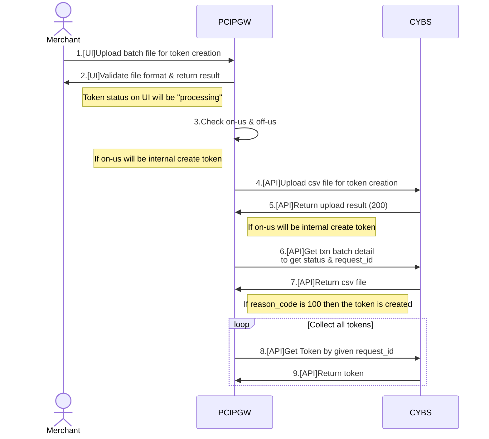
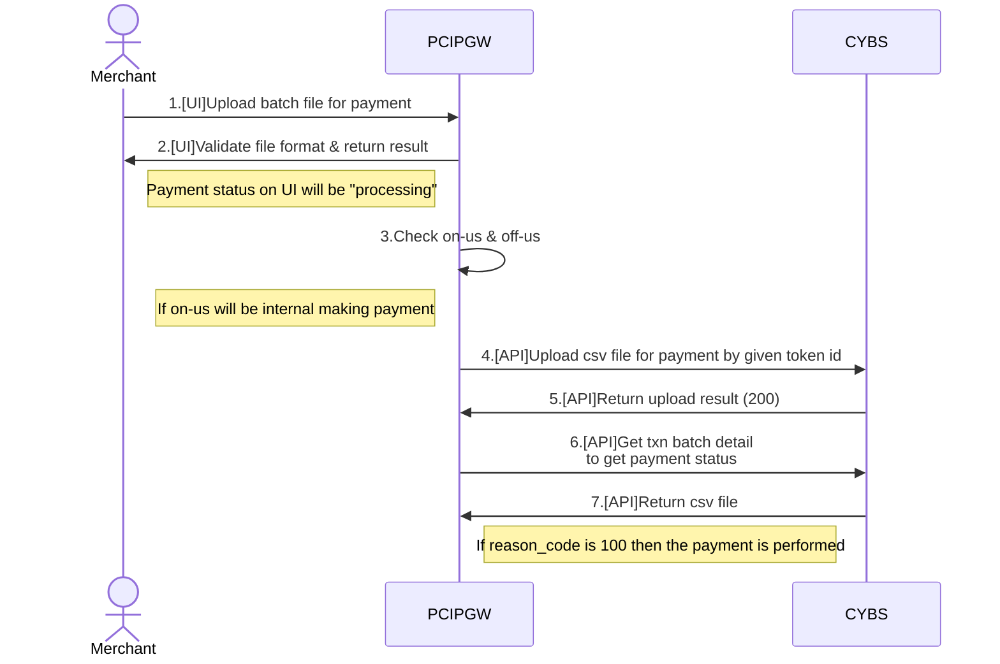

Token Provisioning

```mermaid
    sequenceDiagram
        Actor Merchant
        participant PCIPGW
        participant CYBS
        Merchant->>PCIPGW: 1.[UI]Upload batch file for token creation
        PCIPGW->>Merchant: 2.[UI]Validate file format & return result
        Note left of PCIPGW: Token status on UI will be "processing"
        PCIPGW->>PCIPGW: 3.Check on-us & off-us
        Note left of PCIPGW: If on-us will be internal create token
        PCIPGW->>CYBS: 4.[API]Upload csv file for token creation
        CYBS->>PCIPGW: 5.[API]Return upload result (200)
        Note right of PCIPGW: If on-us will be internal create token
        PCIPGW->>CYBS: 6.[API]Get txn batch detail<br>to get status & request_id
        CYBS->>PCIPGW: 7.[API]Return csv file
        Note right of PCIPGW: If reason_code is 100 then the token is created
        Loop Collect all tokens
            PCIPGW->>CYBS: 8.[API]Get Token by given request_id
            CYBS->>PCIPGW: 9.[API]Return token
        end
```

Create Payment

```mermaid
    sequenceDiagram
        Actor Merchant
        participant PCIPGW
        participant CYBS
        Merchant->>PCIPGW: 1.[UI]Upload batch file for payment
        PCIPGW->>Merchant: 2.[UI]Validate file format & return result
        Note left of PCIPGW: Payment status on UI will be "processing"
        PCIPGW->>PCIPGW: 3.Check on-us & off-us
        Note left of PCIPGW: If on-us will be internal making payment
        PCIPGW->>CYBS: 4.[API]Upload csv file for payment by given token id
        CYBS->>PCIPGW: 5.[API]Return upload result (200)
        PCIPGW->>CYBS: 6.[API]Get txn batch detail<br>to get payment status
        CYBS->>PCIPGW: 7.[API]Return csv file
        Note right of PCIPGW: If reason_code is 100 then the payment is performed
```
