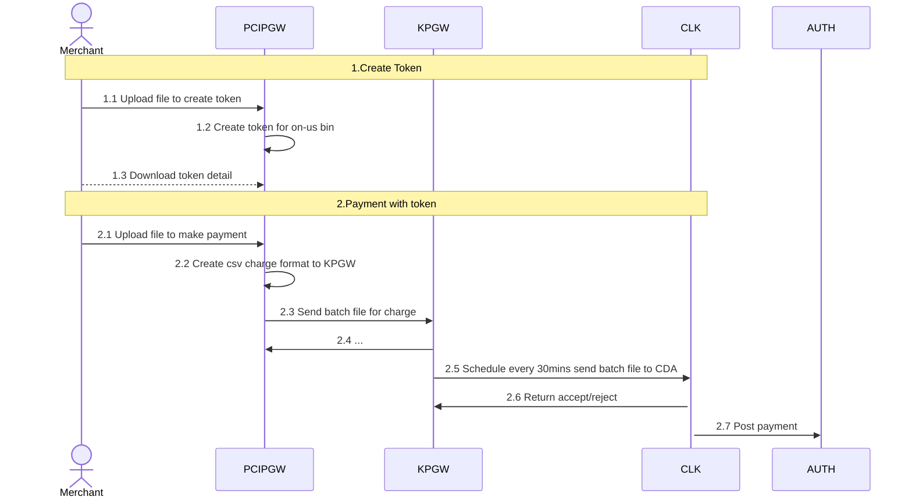

On-Us Recurring

```mermaid
    sequenceDiagram
        Actor Merchant
        participant PCIPGW
        participant KPGW
        participant CLK
        participant AUTH
        Note over Merchant,CLK: 1.Create Token
        Merchant->>PCIPGW: 1.1 Upload file to create token
        PCIPGW->>PCIPGW: 1.2 Create token for on-us bin
        Merchant-->>PCIPGW: 1.3 Download token detail
        Note over Merchant,CLK: 2.Payment with token
        Merchant->>PCIPGW: 2.1 Upload file to make payment
        PCIPGW->>PCIPGW: 2.2 Create csv charge format to KPGW
        PCIPGW->>KPGW: 2.3 Send batch file for charge
        KPGW->>PCIPGW: 2.4 ...
        KPGW->>CLK: 2.5 Schedule every 30mins send batch file to CDA
        activate CLK
        CLK->>KPGW: 2.6 Return accept/reject
        CLK->>AUTH: 2.7 Post payment
        
```
