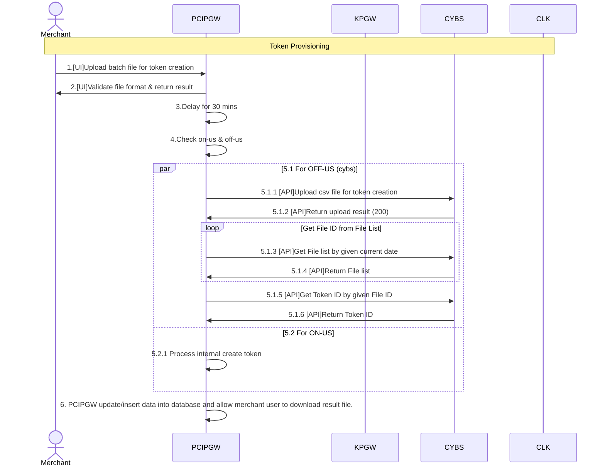
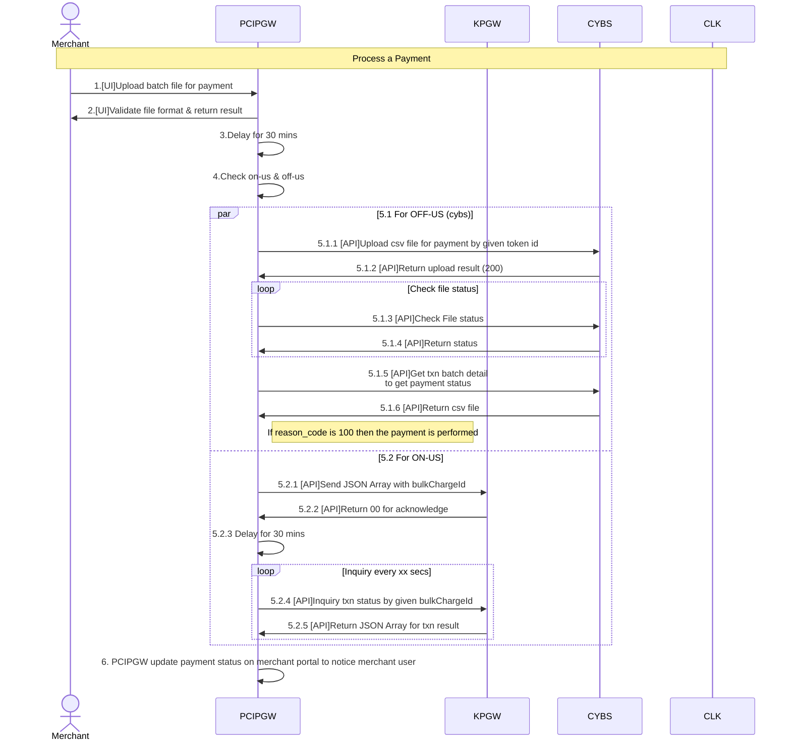
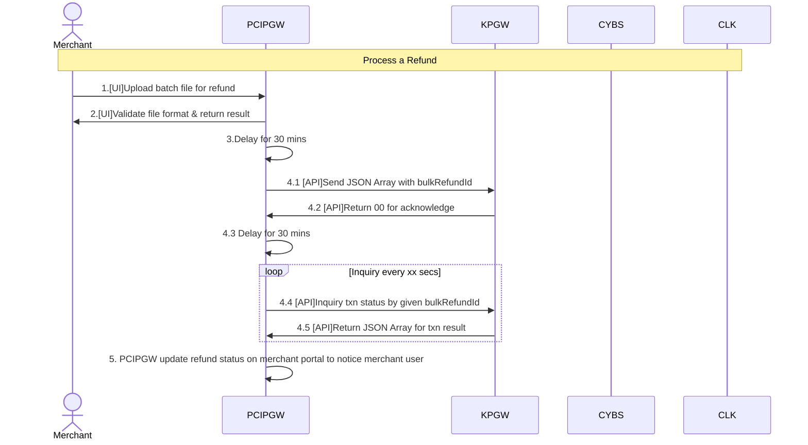

Token Recurring

```mermaid
    sequenceDiagram
        Actor Merchant
        participant PCIPGW
        participant KPGW
        participant CYBS
        participant CLK
        Note over Merchant,CLK: Token Provisioning
        Merchant->>PCIPGW: 1.[UI]Upload batch file for token creation
        PCIPGW->>Merchant: 2.[UI]Validate file format & return result
        PCIPGW->>PCIPGW: 3.Delay for 30 mins 
        PCIPGW->>PCIPGW: 4.Check on-us & off-us
        par 5.1 For OFF-US (cybs)
          PCIPGW->>CYBS: 5.1.1 [API]Upload csv file for token creation
          CYBS->>PCIPGW: 5.1.2 [API]Return upload result (200)
          Loop Get File ID from File List
              PCIPGW->>CYBS: 5.1.3 [API]Get File list by given current date
              CYBS->>PCIPGW: 5.1.4 [API]Return File list
          end
          PCIPGW->>CYBS: 5.1.5 [API]Get Token ID by given File ID
          CYBS->>PCIPGW: 5.1.6 [API]Return Token ID
        and 5.2 For ON-US
          PCIPGW->>PCIPGW: 5.2.1 Process internal create token
        end
        PCIPGW->>PCIPGW: 6. PCIPGW update/insert data into database and allow merchant user to download result file.
```

```mermaid
    sequenceDiagram
        Actor Merchant
        participant PCIPGW
        participant KPGW
        participant CYBS
        participant CLK
        Note over Merchant,CLK: Process a Payment
        Merchant->>PCIPGW: 1.[UI]Upload batch file for payment
        PCIPGW->>Merchant: 2.[UI]Validate file format & return result
        PCIPGW->>PCIPGW: 3.Delay for 30 mins
        PCIPGW->>PCIPGW: 4.Check on-us & off-us
        par 5.1 For OFF-US (cybs)
          PCIPGW->>CYBS: 5.1.1 [API]Upload csv file for payment by given token id
          CYBS->>PCIPGW: 5.1.2 [API]Return upload result (200)
          Loop Check file status
              PCIPGW->>CYBS: 5.1.3 [API]Check File status
              CYBS->>PCIPGW: 5.1.4 [API]Return status
          end
          PCIPGW->>CYBS: 5.1.5 [API]Get txn batch detail<br>to get payment status
          CYBS->>PCIPGW: 5.1.6 [API]Return csv file
          Note right of PCIPGW: If reason_code is 100 then the payment is performed
        and 5.2 For ON-US
          PCIPGW->>KPGW: 5.2.1 [API]Send JSON Array with bulkChargeId
          KPGW->>PCIPGW: 5.2.2 [API]Return 00 for acknowledge
          PCIPGW->>PCIPGW: 5.2.3 Delay for 30 mins
          Loop Inquiry every xx secs
            PCIPGW->>KPGW: 5.2.4 [API]Inquiry txn status by given bulkChargeId
            KPGW->>PCIPGW: 5.2.5 [API]Return JSON Array for txn result
          end
        end
        PCIPGW->>PCIPGW: 6. PCIPGW update payment status on merchant portal to notice merchant user
```

```mermaid
    sequenceDiagram
        Actor Merchant
        participant PCIPGW
        participant KPGW
        participant CYBS
        participant CLK
        Note over Merchant,CLK: Process a Refund
        Merchant->>PCIPGW: 1.[UI]Upload batch file for refund
        PCIPGW->>Merchant: 2.[UI]Validate file format & return result
        PCIPGW->>PCIPGW: 3.Delay for 30 mins
        PCIPGW->>KPGW: 4.1 [API]Send JSON Array with bulkRefundId
        KPGW->>PCIPGW: 4.2 [API]Return 00 for acknowledge
        PCIPGW->>PCIPGW: 4.3 Delay for 30 mins
        Loop Inquiry every xx secs
          PCIPGW->>KPGW: 4.4 [API]Inquiry txn status by given bulkRefundId
          KPGW->>PCIPGW: 4.5 [API]Return JSON Array for txn result
        end
        PCIPGW->>PCIPGW: 5. PCIPGW update refund status on merchant portal to notice merchant user
```
